# dmtools-agents workflow (generated)

Generated from `agents/sm.json`. Only enabled SM rules are shown.

## SM rules

| # | Description | Types | Source statuses | Config file | Skip labels | Add label | Target status |
|---:|---|---|---|---|---|---|---|
1 | PO Review Stories with all subtasks Done → BA Analysis | Story | PO Review | `agents/story_ba_check.json` | `sm_story_ba_check_triggered` |  | —
2 | BA Analysis Stories → generate Acceptance Criteria | Story | BA Analysis | `agents/story_acceptance_criteria.json` | `sm_story_acceptance_criteria_triggered`, `sm_story_acceptance_criterias_triggered` | `sm_story_acceptance_criteria_triggered` | —
3 | Solution Architecture Stories → generate Solution Design | Story | Solution Architecture | `agents/story_solution.json` | `sm_story_solution_triggered` | `sm_story_solution_triggered` | —
4 | Subtasks with 'q' label → trigger PO refinement | Subtask |  | `agents/po_refinement.json` | `sm_po_refinement_triggered` | `sm_po_refinement_triggered` | —
5 | Backlog / To Do Stories → ask clarification questions | Story | Backlog, To Do | `agents/story_questions.json` | `sm_story_questions_triggered`, `ai_questions_asked` | `sm_story_questions_triggered` | —
6 | Backlog / To Do Tasks (children of parent ticket) → run intake agent | Task | Backlog, To Do | `agents/intake.json` | `sm_task_intake_triggered` | `sm_task_intake_triggered` | In Development
7 | Ready For Development Stories → trigger story_development | Story | Ready For Development | `agents/story_development.json` | `sm_story_development_triggered` | `sm_story_development_triggered` | —
8 | Failed Test Cases with linked Bugs → recover Bug To Fix | Test Case | Failed | `agents/recover_failed_tc_bug_status.json` |  |  | —
9 | Failed Test Cases → create or link bugs in batch | Test Case | Failed | `agents/bulk_bugs_creation.json` | `sm_bulk_bugs_creation_triggered` | `sm_bulk_bugs_creation_triggered` | —
10 | Backlog / To Do / Ready For Development / In Development Bugs → trigger bug_development | Bug | Backlog, To Do, Ready For Development, In Development, In Progress | `agents/bug_development.json` | `sm_bug_development_triggered` | `sm_bug_development_triggered` | —
11 | Review/Rework/Blocked Stories & Bugs with already merged PR → recover Merged status | Story, Bug | In Review, In Rework, Blocked | `agents/recover_merged_pr.json` |  |  | —
12 | Blocked Stories & Bugs with all resolved dependencies → move to Backlog | Story, Bug | Blocked | `agents/unblock_resolved_dependencies.json` |  |  | —
13 | In Review Stories & Bugs → trigger pr_review | Story, Bug | In Review | `agents/pr_review.json` | `sm_story_review_triggered` | `sm_story_review_triggered` | —
14 | In Review Stories & Bugs (pr_approved) → retry merge | Story, Bug | In Review | `agents/retry_merge.json` |  |  | —
15 | In Review Test Cases (pr_approved) → retry merge | Test Case | In Review - Passed, In Review - Failed | `agents/retry_merge_test.json` |  |  | —
16 | In Testing Stories (pr_approved) → merge test automation PR | Story | In Testing | `agents/story_test_automation_merge.json` |  |  | —
17 | In Testing Bugs (pr_approved) → merge test automation PR | Bug | In Testing | `agents/bug_test_automation_merge.json` |  |  | —
18 | In Rework Stories & Bugs → trigger pr_rework | Story, Bug | In Rework | `agents/pr_rework.json` | `sm_story_rework_triggered` | `sm_story_rework_triggered` | —
19 | Merged Stories → Ready For Testing + generate test cases | Story | Merged | `agents/test_cases_generator.json` | `sm_test_cases_triggered` | `sm_test_cases_triggered` | Ready For Testing
20 | Merged Bugs → Ready For Testing | Bug | Merged | `agents/bug_merged.json` | `sm_bug_merged_triggered` |  | Ready For Testing
21 | Ready For Testing Bugs → generate test cases | Bug | Ready For Testing | `agents/bug_test_cases_generator.json` | `sm_bug_test_cases_triggered` | `sm_bug_test_cases_triggered` | —
22 | Ready For Testing Bugs → automate linked test cases in bulk | Bug | Ready For Testing | `agents/bug_test_automation.json` | `sm_bug_test_automation_triggered` | `sm_bug_test_automation_triggered` | —
23 | Ready For Testing Stories → automate linked test cases in bulk | Story | Ready For Testing | `agents/story_test_automation.json` | `sm_story_test_automation_triggered` | `sm_story_test_automation_triggered` | —
24 | In Testing Stories → check all TCs passed → Done | Story | In Testing | `agents/story_done_check.json` | `sm_story_done_check_triggered` |  | —
25 | In Testing Bugs → check all TCs passed → Done | Bug | In Testing | `agents/bug_done_check.json` | `sm_bug_done_check_triggered` |  | —
26 | Intake/In Development Tasks → all linked Stories/Bugs Done → Ready For Testing | Task | In Development, In Progress | `agents/task_done_check.json` | `sm_task_done_check_triggered` |  | —
27 | Stuck In Development Test Cases → recover (check PR, route to Rework/Review/Backlog) | Test Case | In Development | `agents/recover_stuck_test_case.json` |  |  | —
28 | In Rework Test Cases → trigger pr_test_automation_rework | Test Case | In Rework | `agents/pr_test_automation_rework.json` | `sm_test_rework_triggered` | `sm_test_rework_triggered` | —
29 | In Review Test Cases → trigger pr_test_automation_review | Test Case | In Review - Passed, In Review - Failed | `agents/pr_test_automation_review.json` | `sm_test_review_triggered` | `sm_test_review_triggered` | —
30 | In Review Test Cases with dirty PR → move to In Rework | Test Case | In Review - Passed, In Review - Failed | `agents/recover_dirty_review_test_case.json` |  |  | —
31 | Failed Test Cases → create or link bug (single, disabled by default — use bulk_bugs_creation instead) | Test Case | Failed | `agents/bug_creation.json` | `sm_bug_creation_triggered` | `sm_bug_creation_triggered` | —
32 | Backlog / To Do / Ready For Development Test Cases → In Development + automate | Test Case | Backlog, To Do, Ready For Development | `agents/test_case_automation.json` | `sm_test_automation_triggered` | `sm_test_automation_triggered` | In Development
33 | Bug To Fix Tickets → all linked Bugs Done → move to Backlog / Ready For Testing | Test Case, Story | Bug To Fix | `agents/bug_to_fix_check.json` | `sm_bug_to_fix_check_triggered` |  | —

## Flow diagram

```mermaid
flowchart TD
    S_BA_Analysis["BA Analysis"]
    S_Backlog["Backlog"]
    S_Blocked["Blocked"]
    S_Bug_To_Fix["Bug To Fix"]
    S_Failed["Failed"]
    S_In_Development["In Development"]
    S_In_Progress["In Progress"]
    S_In_Review["In Review"]
    S_In_Review___Failed["In Review - Failed"]
    S_In_Review___Passed["In Review - Passed"]
    S_In_Rework["In Rework"]
    S_In_Testing["In Testing"]
    S_Merged["Merged"]
    S_PO_Review["PO Review"]
    S_Ready_For_Development["Ready For Development"]
    S_Ready_For_Testing["Ready For Testing"]
    S_Solution_Architecture["Solution Architecture"]
    S_To_Do["To Do"]
    S_PO_Review["PO Review"] --> A0_["story_ba_check"]
    S_BA_Analysis["BA Analysis"] --> A1_["story_acceptance_criteria"]
    S_Solution_Architecture["Solution Architecture"] --> A2_["story_solution"]
    S_Backlog["Backlog"] --> A4_["story_questions"]
    S_To_Do["To Do"] --> A4_["story_questions"]
    S_Backlog["Backlog"] --> A5_["intake"]
    S_To_Do["To Do"] --> A5_["intake"]
    A5_["intake"] --> S_In_Development["In Development"]
    S_Ready_For_Development["Ready For Development"] --> A6_["story_development"]
    S_Failed["Failed"] --> A7_["recover_failed_tc_bug_status"]
    S_Failed["Failed"] --> A8_["bulk_bugs_creation"]
    S_Backlog["Backlog"] --> A9_["bug_development"]
    S_To_Do["To Do"] --> A9_["bug_development"]
    S_Ready_For_Development["Ready For Development"] --> A9_["bug_development"]
    S_In_Development["In Development"] --> A9_["bug_development"]
    S_In_Progress["In Progress"] --> A9_["bug_development"]
    S_In_Review["In Review"] --> A10_["recover_merged_pr"]
    S_In_Rework["In Rework"] --> A10_["recover_merged_pr"]
    S_Blocked["Blocked"] --> A10_["recover_merged_pr"]
    S_Blocked["Blocked"] --> A11_["unblock_resolved_dependencies"]
    S_In_Review["In Review"] --> A12_["pr_review"]
    S_In_Review["In Review"] --> A13_["retry_merge"]
    S_In_Review___Passed["In Review - Passed"] --> A14_["retry_merge_test"]
    S_In_Review___Failed["In Review - Failed"] --> A14_["retry_merge_test"]
    S_In_Testing["In Testing"] --> A15_["story_test_automation_merge"]
    S_In_Testing["In Testing"] --> A16_["bug_test_automation_merge"]
    S_In_Rework["In Rework"] --> A17_["pr_rework"]
    S_Merged["Merged"] --> A18_["test_cases_generator"]
    A18_["test_cases_generator"] --> S_Ready_For_Testing["Ready For Testing"]
    S_Merged["Merged"] --> A19_["bug_merged"]
    A19_["bug_merged"] --> S_Ready_For_Testing["Ready For Testing"]
    S_Ready_For_Testing["Ready For Testing"] --> A20_["bug_test_cases_generator"]
    S_Ready_For_Testing["Ready For Testing"] --> A21_["bug_test_automation"]
    S_Ready_For_Testing["Ready For Testing"] --> A22_["story_test_automation"]
    S_In_Testing["In Testing"] --> A23_["story_done_check"]
    S_In_Testing["In Testing"] --> A24_["bug_done_check"]
    S_In_Development["In Development"] --> A25_["task_done_check"]
    S_In_Progress["In Progress"] --> A25_["task_done_check"]
    S_In_Development["In Development"] --> A26_["recover_stuck_test_case"]
    S_In_Rework["In Rework"] --> A27_["pr_test_automation_rework"]
    S_In_Review___Passed["In Review - Passed"] --> A28_["pr_test_automation_review"]
    S_In_Review___Failed["In Review - Failed"] --> A28_["pr_test_automation_review"]
    S_In_Review___Passed["In Review - Passed"] --> A29_["recover_dirty_review_test_case"]
    S_In_Review___Failed["In Review - Failed"] --> A29_["recover_dirty_review_test_case"]
    S_Failed["Failed"] --> A30_["bug_creation"]
    S_Backlog["Backlog"] --> A31_["test_case_automation"]
    S_To_Do["To Do"] --> A31_["test_case_automation"]
    S_Ready_For_Development["Ready For Development"] --> A31_["test_case_automation"]
    A31_["test_case_automation"] --> S_In_Development["In Development"]
    S_Bug_To_Fix["Bug To Fix"] --> A32_["bug_to_fix_check"]
```

---
_Generated by js/agentWorkflowGraph.js_