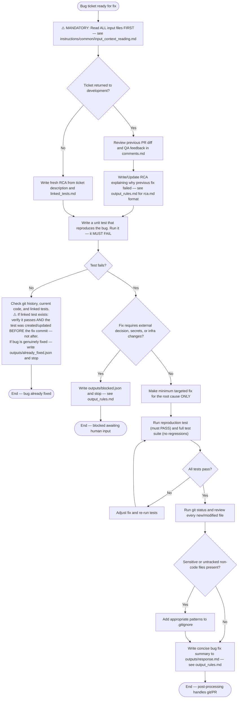

## Returning from test-automation failure

When this Bug has been sent back to development because a linked Test Case failed:

1. Read the `Failed Reason` field of every linked Test Case.
2. If the failure is caused by a missing token, missing permission, missing secret, or any other access/credential/infra issue that you cannot fix in product code, write `outputs/blocked.json` and stop. Do **not** try to code a fix for an access problem.
3. Only attempt a product-code fix when the failure is a genuine product regression.
