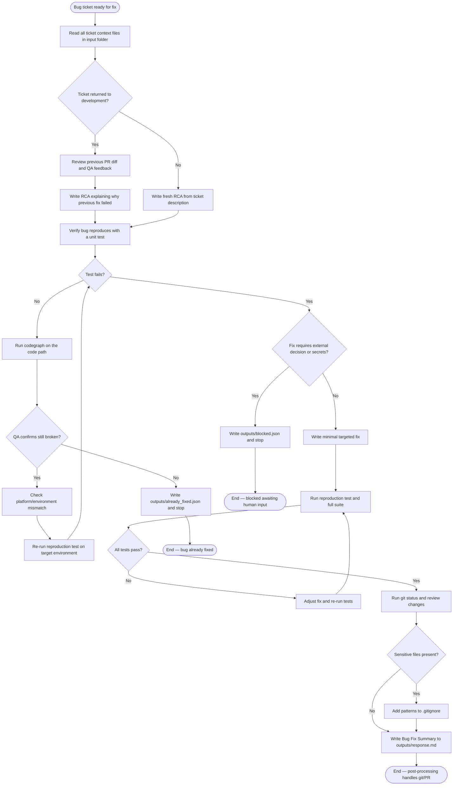

```mermaid
flowchart TD
    START([Bug ticket ready for fix]) --> READ[Read all ticket context files in input folder]
    READ --> RETURNED{Ticket returned to development?}
    RETURNED -->|Yes| PREV[Review previous PR diff and QA feedback]
    PREV --> RCA1[Write RCA explaining why previous fix failed]
    RETURNED -->|No| RCA2[Write fresh RCA from ticket description]
    RCA1 --> REPRO[Verify bug reproduces with a unit test]
    RCA2 --> REPRO
    REPRO --> EXISTS{Test fails?}
    EXISTS -->|No| ALREADY[Run codegraph on the code path]
    ALREADY --> CONFIRM{QA confirms still broken?}
    CONFIRM -->|No| FIXED[Write outputs/already_fixed.json and stop]
    CONFIRM -->|Yes| PLATFORM[Check platform/environment mismatch]
    PLATFORM --> REPRO2[Re-run reproduction test on target environment]
    REPRO2 --> EXISTS
    EXISTS -->|Yes| BLOCKED{Fix requires external decision or secrets?}
    BLOCKED -->|Yes| BLOCK[Write outputs/blocked.json and stop]
    BLOCKED -->|No| TDD[Write minimal targeted fix]
    TDD --> VERIFY[Run reproduction test and full suite]
    VERIFY --> PASS{All tests pass?}
    PASS -->|No| ADJUST[Adjust fix and re-run tests]
    ADJUST --> VERIFY
    PASS -->|Yes| GITSTATUS[Run git status and review changes]
    GITSTATUS --> SECRETS{Sensitive files present?}
    SECRETS -->|Yes| IGNORE[Add patterns to .gitignore]
    SECRETS -->|No| SUMMARY[Write Bug Fix Summary to outputs/response.md]
    IGNORE --> SUMMARY
    SUMMARY --> END([End — post-processing handles git/PR])
    FIXED --> END_F([End — bug already fixed])
    BLOCK --> END_B([End — blocked awaiting human input])
```
