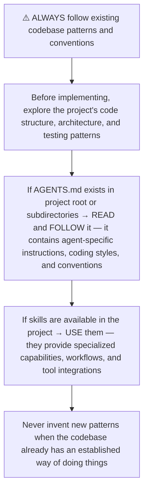

```mermaid
flowchart TD
    G1["⚠️ ALWAYS follow existing codebase patterns and conventions"]
    G2["Before implementing, explore the project's code structure, architecture, and testing patterns"]
    G3["If AGENTS.md exists in project root or subdirectories → READ and FOLLOW it — it contains agent-specific instructions, coding styles, and conventions"]
    G4["If skills are available in the project → USE them — they provide specialized capabilities, workflows, and tool integrations"]
    G5["Never invent new patterns when the codebase already has an established way of doing things"]
    G1 --> G2 --> G3 --> G4 --> G5
```
