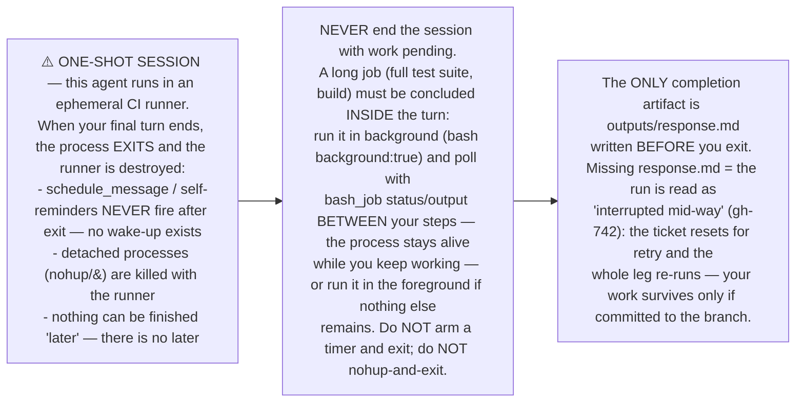

**Evidence (fa#1341, 2026-10-07):** the dev agent finished its edits, launched
the full test suite detached (`nohup dart test &`), armed a `schedule_message`
wake-up "in 18m", and ended its turn. The process exited code 0, the timer
could never fire, `outputs/response.md` was never written — the leg failed
twice in a row with the same "interrupted mid-way" reset, burning two full
dev runs on a completed implementation.
