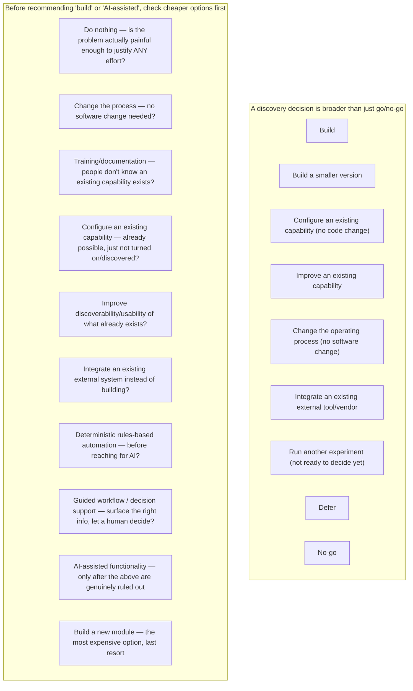

## Solution classes — don't default to "build something new" or "add AI"

When proposing a direction in `recommendations.md` or `prd.md`, generate options across these classes and explain why the cheaper ones were ruled out, not just why the chosen one works. Do not assume new software, and do not assume AI, is the preferred mechanism merely because it's available or novel — see the `BEFORE` checklist above, roughly cheapest-to-most-expensive.

## Automation boundary — classify any proposed automation

Whenever a solution involves automating a decision or action, classify it explicitly — do not casually call something "AI-powered" without first checking whether it needs to be:

| Boundary | Meaning | When appropriate |
|---|---|---|
| **Deterministic automation** | Rules are explicit, complete, and safe to execute without a human in the loop | Rules are fully known and stable |
| **Rules-based recommendation** | Rules are explicit but a human confirms before acting | Rules are known but consequences of a wrong call are material |
| **Decision support** | System organizes/surfaces the relevant evidence; a human still decides | Judgment genuinely required, rules incomplete |
| **Expert judgment** | The decision cannot be safely reduced to current rules at all | Complexity or stakes are too high to encode |

Test first whether the actual problem is missing structure, missing data, fragmented rules, poor interface design, or weak integration — before concluding "this needs AI."

## Brainstorming techniques (pick what fits, don't force all of them)

How Might We · Five Whys (root cause) · Challenge assumptions · Reverse brainstorming · SCAMPER · Eliminate/simplify/automate (in that order) · Exception-first design (design for the failure/edge case first, not the happy path) · Pre-mortem ("imagine this failed — why?") · Guardrail-first design (define what must never happen before designing what should) · Analogy from an adjacent domain · Future-back (start from the desired end state, work backward) · Zero-based workflow design (design as if starting from nothing, ignoring current process inertia).

## Experiment design — match method to the risk being tested

Don't default to "user interview" for every risk — pick the method that actually reduces the *dominant* risk:

| Risk being tested | Suitable methods |
|---|---|
| **Value** | Problem interview, concept test, concierge test (manually deliver the outcome before building it), pilot adoption |
| **Usability** | Task-based prototype test, cognitive walkthrough |
| **Feasibility** | Technical spike, data-quality analysis, integration prototype |
| **Rule/logic accuracy** | Historical replay against real past cases, retrospective simulation |
| **Business viability** | Cost model, implementation-effort assessment, pricing test |
| **Adoption** | Feature flag, controlled pilot, usage analytics |
| **Safety/operational risk** (when the domain has real safety/compliance stakes) | Shadow mode (run alongside the real process without acting), parallel run, expert-agreement/error analysis |

For any higher-stakes automation, prefer the safer, reversible methods first: historical replay → shadow mode → human-approved pilot → parallel run with explicit error analysis and rollback — before a full, irreversible rollout.

### Measurement contract — define these for every experiment, before running it

Baseline · Target · Success metric · Guardrail metric (what must NOT get worse) · Safety metric (if applicable) · Adoption metric (if relevant) · Measurement source · Known data-quality limitation.

Classify the result as exactly one of: **Passed** / **Failed** / **Inconclusive** / **Invalid experiment** (the test itself was flawed) — never quietly reinterpret a failed or inconclusive result as a pass.

## Readiness — use a 4-state verdict, not a binary one

A binary "ready/not ready" hides the realistic middle ground. Use:

- **Not ready** — material unknowns remain with no plan to resolve them
- **Conditionally ready** — ready to proceed IF specific named conditions are met first (list them)
- **Ready with accepted residual risk** — proceeding, with a named, explicitly accepted risk and owner (not silently ignored)
- **Ready** — dominant risks addressed to the team's satisfaction, no material residual risk

A long PRD or a full set of discovery pages is not, by itself, evidence of readiness — judge against the actual risk evidence, not the page count.

## Publication / sensitivity governance gate

Discovery input (ticket comments, interview notes, attached documents, code) can contain information that should not go into a broadly-readable Confluence page as-is. Before publishing, check for and handle:

- Personally identifiable information (names, contact details, or other individually-identifying data about a real customer/participant/employee) — replace with a role or a research ID (e.g. "Participant 3", "Customer B") rather than a real name, unless the ticket/source explicitly says publishing the real identity is fine.
- Credentials, API keys, tokens, internal endpoints, or other secrets — never copy these into a discovery page even if they appeared in the source material; redact and note that they were redacted.
- Direct quotations from a real person — only include if there's a clear indication consent was given for that quote to be shared/published; otherwise paraphrase without attribution.
- Cross-customer/cross-segment comparisons that could reveal one customer's specifics to another audience — anonymize (e.g. "Customer A" / "Customer B") unless the intended audience is authorized to see real names.
- Any domain-sensitive conclusion (legal, safety, compliance, medical, financial) — flag it as **needing human review** rather than stating it as settled fact.

If a material sensitivity issue can't be resolved within this run, note it explicitly (e.g. in `recommendations.md` or a dedicated note) rather than publishing around it silently — the goal is to make the gap visible, not to block indefinitely without explanation.
