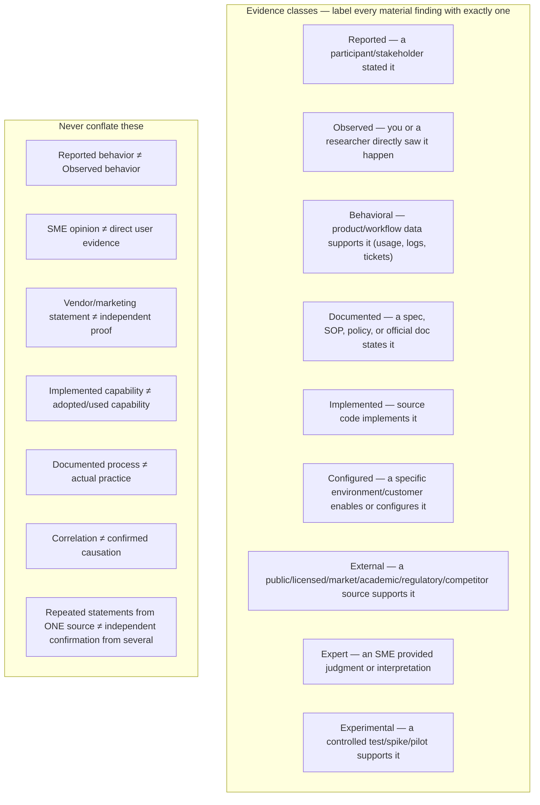

## Why this matters

"I found evidence" means very different things depending on where it came from. Labeling every finding with its evidence class prevents the single most common discovery failure: treating a hunch, a vendor claim, or one person's opinion as if it were confirmed fact. When writing a finding, name its class inline or in a table column — e.g. "(observed)", "(reported — 1 stakeholder)", "(implemented, not yet confirmed used)".

## Confidence guidance

Confidence is not a vote count — weigh source quality, independence, directness, and scope:

| Confidence | Typical support |
|------------|------------------|
| **Low** | One unsupported request, opinion, or weak external claim |
| **Medium** | Repeated reports, one direct observation, or one robust behavioral source |
| **High** | Multiple independent roles/sources plus observed or behavioral evidence |
| **Very high** | Multiple independent evidence classes, measured impact, contradictions resolved |

## Turning assumptions into neutral research questions

Before designing an interview, survey, or research task, convert every assumption into a neutral question that could disconfirm it — never phrase it to confirm a preferred answer.

| Assumption (don't ask this) | Neutral research question (ask this instead) |
|---|---|
| "Users struggle with feature X" | "How do users currently accomplish [the underlying job], and where (if anywhere) does that break down?" |
| "Customers want an AI assistant" | "What is the underlying job/outcome the customer actually needs, independent of any specific mechanism?" |

## Research firewall — don't let the pitch become the finding

Whoever runs the research (a human interviewer, an external research task, a deep-web-search prompt) must receive a **neutral assignment**, not a request to validate a preferred solution:

- **Good assignment**: "Identify current approaches to [the underlying problem], including evidence for AND against automation/a new tool."
- **Bad assignment**: "Find evidence that [our proposed solution] is valuable."

Context can shape *which* questions get asked; it must never become the answer itself.

## Method selection — matching evidence need to method

Different questions need different evidence-gathering methods. Don't default to "just ask people" for everything:

| Evidence need | Preferred method |
|---|---|
| What people say about their process | Semi-structured interview |
| What people actually do (vs. what they say) | Contextual inquiry / shadowing / direct observation |
| A specific recent failure/exception | Critical-incident interview ("show me the last time X happened") |
| An end-to-end process | Workflow walkthrough |
| Whether documented process matches real practice | Observation + document review, compared side by side |
| Reaction to a proposed concept | Concept test |
| Usability / error risk of a specific interaction | Task-based usability test |
| A long-running or infrequent workflow | Diary study / repeated follow-up |
| Whether an existing capability solves it already | Codebase/config investigation (see `investigate_before_writing.md`) before recruiting anyone |
| Market patterns, competitor capabilities, public sentiment | External/web research |

## Scenario-based questions beat hypothetical ones

Prefer asking someone to show or reconstruct a **real recent case** over asking what they'd hypothetically do:

- Prefer: *"Show me the most recent case where [the process] broke down or needed an exception."*
- Avoid: *"Would you use an automated feature for this?"*

People are unreliable predictors of their own future behavior with a not-yet-built thing; they're good at recounting what actually just happened.

## Atomic, falsifiable evidence — not vibes

Each evidence statement should support exactly one defensible, falsifiable finding — not a vague conclusion:

- **Bad**: "The process is inefficient and needs automation."
- **Good**: "The user opened three separate tools (the primary system, a spreadsheet, and a chat app) before completing the task — observed in 2 of 3 sessions."

## Searching for evidence against

For every material problem or opportunity, actively look for counter-evidence before writing a conclusion: contexts where it does NOT occur, a successful current workaround, low measured frequency, an existing capability that already covers it, or a contradictory account from another source. Do not suppress a contradiction to make the write-up cleaner — surface it (see `general_guidelines.md`'s "No silent contradiction resolution").

## Cross-segment / cross-customer comparison

When a discovery spans multiple customers, sites, teams, or segments, build an explicit comparison table rather than blending everyone's input into one narrative:

`Problem or pattern | Segment/customer A | Segment/customer B | Segment/customer C | Common pattern | Local variation | Implication`

Classify each row's implication as one of: **core opportunity** (affects everyone, worth solving generally) / **segment-specific need** / **configuration gap** (already solvable via existing config) / **implementation gap** (a bug or incomplete rollout, not a new need) / **integration issue** / **training/discoverability issue** / **local process problem** (specific to one team's way of working, not a product issue).
