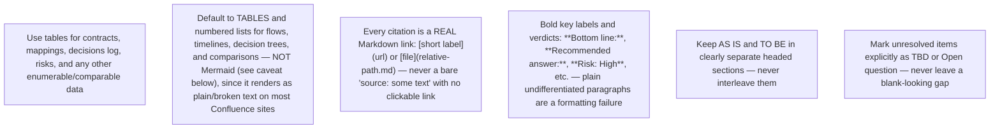

## Rich formatting is required, not optional

A wall of plain, unformatted paragraphs is a **formatting failure**, even if the content itself is accurate. Every file should look like a real Confluence page, not a text dump:

- **Bold** every label/verdict/risk-level the reader needs to scan for: `**Bottom line:**`, `**Recommended answer:**`, `**Confidence: Medium**`, `**Risk: High**`, `**Dominant risk:**`.
- Use `##`/`###` subheadings to break up long sections instead of one continuous block.
- Use bullet or numbered lists for anything sequential or enumerable — proposals, steps, findings.
- Use *italics* for caveats, assumptions, or secondary asides.

## Tables over prose for structured data

Prefer a table whenever you are recording: risks (risk type | severity | evidence bar | status), decisions (decision | date/source | status), open questions (question | risk type | evidence bar | status), competitor/alternative comparisons (option | strengths | weaknesses | pricing/notes), or field/interface mappings (field | source | target | notes).

## Mermaid diagrams — NOT the default, only as a carefully-fenced fallback

⚠️ **Confluence Cloud does not natively render Mermaid diagrams** — it requires a marketplace plugin that most spaces don't have installed, and this agent has no way to know whether a given project's Confluence does. Writing raw Mermaid syntax expecting it to render as a diagram produces exactly the opposite of "richer formatting": either broken/garbled plain text (if not code-fenced) or, at best, an unrendered monospace code block showing diagram syntax nobody asked to read.

**Default to tables and numbered/bulleted lists** for flows, timelines, decision sequences, and comparisons — these render correctly on every Confluence instance with zero risk. Reserve Mermaid for the rare case where a table genuinely cannot express the relationship (e.g. a branching decision tree), and even then:

- Always wrap it in a proper fenced code block: ` ```mermaid ` ... ` ``` ` — never as bare unfenced text (which is what produces garbled prose, not even a readable code block).
- Immediately follow it with the same information as a table or list, so the content is still fully readable even if the diagram itself doesn't render on the target Confluence.

## Links and references are mandatory, not decorative

Every finding sourced from the web, a linked Confluence page, or a codebase file **must** be a real Markdown link, not plain text naming the source:

- Web research: `[Vendor X product docs](https://example.com/docs)`, not "source: Vendor X docs" or a bare pasted URL with no link syntax.
- Codebase findings: `[UserService.java](../src/main/java/.../UserService.java)` style reference (or the file path in backtick-code if it isn't a resolvable relative link from the output folder) plus the relevant symbol/line if known.
- External non-web artifacts (a recorded call, a shared spec document, a design file, an example data file, a diagramming-tool link) — link them the same way: `[gap-analysis-2026-04.xlsx](https://.../shared-doc-link)`. Never just name an artifact without its link, even if the link is long/ugly — a reader needs to actually reach it.
- Cross-file references within this discovery output: `[see the PRD](prd.md)` per the Cross-linking section below. ⚠️ The link **text** must be a natural-language phrase, never the bare filename — see the Cross-linking section for why this matters more than it looks.
- A **References** section at the bottom of any file with more than 2 citations, listing every link once, is preferred over scattering unlinked source names through prose. If the discovery as a whole accumulates several such artifacts across multiple files, also add them to the discovery-wide `references.md` (see `output_rules.md`) so they're all findable from one place.

## Evidence and decisions must be traceable

Every row in a decisions/assumptions/open-questions table needs a source column with a real link where one exists (a URL, a Confluence page, a file path) — "ticket comment 2026-07-20" is acceptable only when there is genuinely no linkable artifact (e.g. a verbal/chat comment with no URL). Never leave the source column blank.

## Findings must be atomic and falsifiable, not vague vibes

A finding should support exactly one defensible, checkable claim — not a sweeping conclusion:

- **Bad**: "The process is inefficient and needs automation."
- **Good**: "The user opened three separate tools (the primary system, a spreadsheet, and a chat app) before completing the task — observed in 2 of 3 sessions."

See `evidence_and_methods.md` for the full evidence-class vocabulary this pairs with.

## Self-check before finishing EACH file (not just recommendations.md)

⚠️ Every single file in `outputs/discovery/` — not only `recommendations.md` — needs this check. See `modes.md`'s "Per-mode required structure" for the specific table(s) each mode's file needs. Before moving to the next file, verify:

1. Does this file contain **at least one Markdown table** (`| ... | ... |`)? If a file only has `##` headings and bullet/numbered lists with zero tables, go back and add the table `modes.md` specifies for that mode — this is the single most common formatting failure.
2. Does this file have **at least 3 bolded terms** (`**...**`)? Plain `<h2>` + `<ul>` with no bold anywhere is a formatting failure even if a table is present elsewhere.
3. Is every external/web finding a clickable `[label](url)` link, not a bare product/tool name with no href?
4. If the honest answer to 1 or 2 is "no" — stop and fix that file before writing the next one. Do not treat rich formatting as optional polish only for `recommendations.md`; every mode file needs it.
