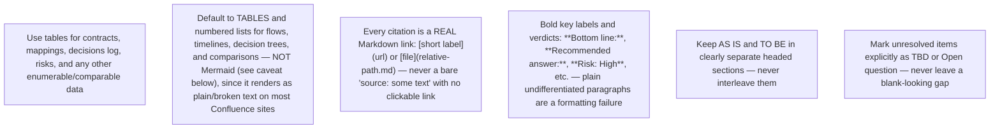

## Rich formatting is required, not optional

A wall of plain, unformatted paragraphs is a **formatting failure**, even if the content itself is accurate. Every file should look like a real Confluence page, not a text dump:

- **Bold** every label/verdict/risk-level the reader needs to scan for: `**Bottom line:**`, `**Recommended answer:**`, `**Confidence: Medium**`, `**Risk: High**`, `**Dominant risk:**`.
- Use `##`/`###` subheadings to break up long sections instead of one continuous block.
- Use bullet or numbered lists for anything sequential or enumerable — proposals, steps, findings.
- Use *italics* for caveats, assumptions, or secondary asides.

## Tables over prose for structured data

Prefer a table whenever you are recording: risks (risk type | severity | evidence bar | status), decisions (decision | date/source | status), open questions (question | risk type | evidence bar | status), competitor/alternative comparisons (option | strengths | weaknesses | pricing/notes), or field/interface mappings (field | source | target | notes).

## Mermaid diagrams — NOT the default, only as a carefully-fenced fallback

⚠️ **Confluence Cloud does not natively render Mermaid diagrams** — it requires a marketplace plugin that most spaces don't have installed, and this agent has no way to know whether a given project's Confluence does. Writing raw Mermaid syntax expecting it to render as a diagram produces exactly the opposite of "richer formatting": either broken/garbled plain text (if not code-fenced) or, at best, an unrendered monospace code block showing diagram syntax nobody asked to read.

**Default to tables and numbered/bulleted lists** for flows, timelines, decision sequences, and comparisons — these render correctly on every Confluence instance with zero risk. Reserve Mermaid for the rare case where a table genuinely cannot express the relationship (e.g. a branching decision tree), and even then:

- Always wrap it in a proper fenced code block: ` ```mermaid ` ... ` ``` ` — never as bare unfenced text (which is what produces garbled prose, not even a readable code block).
- Immediately follow it with the same information as a table or list, so the content is still fully readable even if the diagram itself doesn't render on the target Confluence.

## Links and references are mandatory, not decorative

Every finding sourced from the web, a linked Confluence page, or a codebase file **must** be a real Markdown link, not plain text naming the source:

- Web research: `[Remotion docs](https://www.remotion.dev/)`, not "source: Remotion docs" or a bare pasted URL with no link syntax.
- Codebase findings: `[UserService.java](../src/main/java/.../UserService.java)` style reference (or the file path in backtick-code if it isn't a resolvable relative link from the output folder) plus the relevant symbol/line if known.
- Cross-file references within this discovery output: `[see the PRD](prd.md)` per the Cross-linking section below.
- A **References** section at the bottom of any file with more than 2 citations, listing every link once, is preferred over scattering unlinked source names through prose.

## Evidence and decisions must be traceable

Every row in a decisions/assumptions/open-questions table needs a source column with a real link where one exists (a URL, a Confluence page, a file path) — "ticket comment 2026-07-20" is acceptable only when there is genuinely no linkable artifact (e.g. a verbal/chat comment with no URL). Never leave the source column blank.
