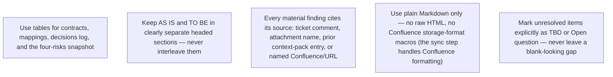

## Headings

Start each file with a single `#` H1 matching its purpose (e.g. `# Discovery Plan`), since the sync tool derives the Confluence page title from this heading when present, falling back to the filename otherwise.

## Tables over prose for structured data

Prefer a table whenever you are recording: risks (risk type | severity | evidence bar | status), decisions (decision | date/source | status), open questions (question | risk type | evidence bar | status), or field/interface mappings (field | source | target | notes).

## Evidence and decisions must be traceable

Every row in a decisions/assumptions/open-questions table needs a source column — "ticket comment 2026-07-20", "attachment: spec.pdf", or "prior discovery context" are all acceptable; never leave it blank.
