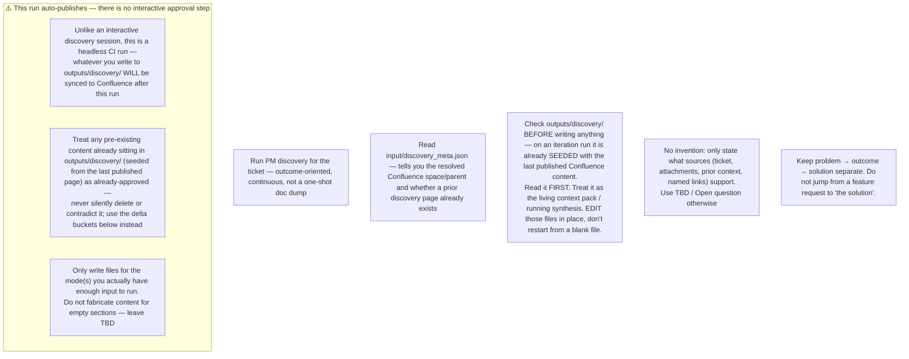

## Problem → outcome → solution

Keep these layers separate in every artefact you write:

1. **Problem** — whose pain / job; why it matters now
2. **Outcome** — measurable or observable change if this succeeds
3. **Solution ideas** — options under consideration
4. **Committed solution (for build)** — only what sources/decisions actually support

Do not leap from a stakeholder feature request straight to "the solution" without naming the problem and outcome first.

## Four big risks

Use these consistently in the discovery plan, open questions, experiment design, and readiness sections:

| Risk | Question |
|------|----------|
| **Value** | Will users/customers choose to use it? Does it solve a real problem? |
| **Usability** | Can they figure out how to use it in their real workflow? |
| **Feasibility** | Can we build/operate it with our skills, time, systems, and partners? |
| **Business viability** | Does it work for the business (compliance, partners, cost, go-to-market, brand, ops)? |

For each material unknown: name the risk type, its severity (High/Med/Low/Unknown), and the lightest adequate **evidence bar** (e.g. stakeholder confirmation, workflow observation, prototype feedback, technical spike, compliance confirmation, metrics baseline). Do not demand the same rigor for every TBD — high consequence needs stronger evidence, low risk needs lighter confirmation.

## Iteration protocol (when outputs/discovery/ is already seeded with prior published content)

Before writing anything, check `outputs/discovery/` — on an iteration run it already contains the last published Confluence content (seeded by the pre-CLI step), not an empty folder. When it is non-empty, produce a delta and edit those same files in place instead of rewriting from scratch:

| Bucket | Meaning |
|--------|---------|
| **Confirms** | Reinforces an existing decision / requirement |
| **Changes** | Updates prior understanding (cite old → new) |
| **Contradicts** | Conflicts with prior context or another source — do not resolve silently, surface it |
| **New** | Net-new requirement, field, flow, or constraint |
| **New open questions** | With risk type + evidence bar |
| **Scope impact** | Suggested in-scope / out-of-scope moves |

Update the relevant `outputs/discovery/*.md` file(s) **in place** with the merged result (prior content + delta) — since these files already contain the prior published state, this is a direct edit, not a copy-then-merge step. Note the delta itself in `outputs/discovery/index.md`'s "Last iteration" section too — don't leave the delta only in chat/log output, since Confluence readers only see the published files.

## Working rules

1. **Source of truth**: ticket description/comments/attachments for "what was asked"; any content already seeded in `outputs/discovery/` for "what was already published"; any Confluence/URL the ticket or its comments point to for "what is documented elsewhere". Call out conflicts across sources — do not silently pick a side.
2. **No invention**: only state what sources support. Use **TBD** or **Open question** otherwise.
3. **Preserve detail**: do not drop field values, status rules, interface names, owners, exception paths, or decisions. Prefer tables for contracts and mappings.
4. **AS IS vs TO BE**: keep current-state and future-state clearly separated; label working assumptions.
5. **Traceability**: every material finding cites its source (ticket comment, attachment name, Confluence section, prior context-pack entry).
6. **Experiment over documentation**: when the dominant risk is Value or Usability, prefer proposing the cheapest test (interview, walkthrough, prototype, spike) over writing more pages.
7. **Trio check**: before marking discovery "ready for delivery", note whether Product / Engineering / Design-UX (or the closest available roles) have reviewed the dominant risks — record who reviewed, or mark **pending**. Do not invent reviewers.
