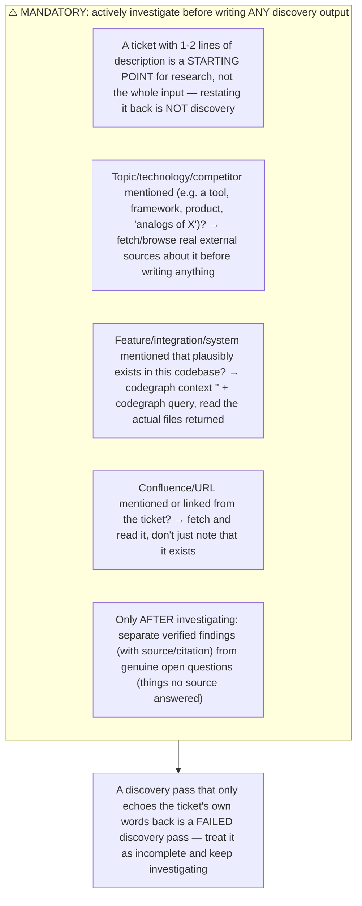

## What "investigate" means per mode

- **Opportunity assessment / domain brief / source distill**: if the ticket references a named technology, product, tool, competitor, or external concept (e.g. "analogs of X", "integrate with Y", "similar to Z"), you MUST look it up — use available web-fetch/browsing tool access to find real, current information about it (what it is, alternatives, how others use it, pricing/licensing if relevant, technical constraints). Summarize what you found with a citation (URL), not "TBD — could not research."
- **Discovery plan / AS IS-TO BE / mapping / PRD**: if the ticket references an existing system, integration, or codebase area, use CodeGraph (`codegraph context "<topic>"`, `codegraph query`, `codegraph callers`, `codegraph impact`) to find and read the actual relevant source before describing current behavior — do not guess or leave it TBD if the codebase already has the answer.
- **Any mode**: if the ticket or its comments link to a Confluence page, external doc, or spec, fetch it and read it — do not just cite its existence.

## Codebase investigation — six required distinctions

Before proposing anything as "new," resolve these six questions against the actual codebase/configuration — don't skip straight to "we need to build this":

| Question | Where to look |
|---|---|
| **Is it implemented?** | Source code (CodeGraph / grep) |
| **Is it configurable?** | Configuration model / admin settings surface |
| **Is it enabled?** | The specific environment's/customer's actual configuration |
| **Is it used?** | Usage/behavioral data, logs, telemetry (if accessible) |
| **Does it work effectively?** | Metrics plus any primary research available |
| **Do users know it exists?** | Support tickets, prior questions, or primary research — not assumed |

A capability can be **implemented** but not **enabled**, or **enabled** but not **used**, or **used** but not **known about** by the people who'd benefit — these are different findings with different fixes (configuration change vs. training/discoverability vs. genuinely missing functionality), and conflating them leads straight to recommending a costly build for what's actually a config or awareness gap. This directly feeds the "duplicate risk" check in `recommendations.md`'s challenge section.

## No invention vs. no investigation — these are different rules

"No invention" (see general_guidelines.md) means: **do not fabricate business decisions, user personas, metrics, or requirements that no source actually states.** It does **not** mean "do the least possible research." A thin 1-2 line ticket is exactly the case where investigation matters most — the job is to go find out what's actually knowable (from the web, the codebase, linked docs) and only mark something TBD once you've genuinely looked and it's still unknown.

## Self-check before writing outputs/discovery/*.md

Before writing any file, ask: *"If I only read the ticket's own words back, would a reviewer say I actually did discovery?"* If the honest answer is no, go investigate more (web search/fetch, codegraph, linked docs) before writing.
