```mermaid
flowchart TD
    MR["Optional Mode R: Research brief — decision framing BEFORE evidence gathering, for ambiguous/high-stakes tickets only"]
    M0["Mode 0: Opportunity assessment — problem, who, alternatives, why now, success metrics, go/no-go.<br/>If a named tech/product/competitor is involved: research it (web) first"]
    M1["Mode 1: Domain brief — plain-language explainer of the domain/context for the team.<br/>Research the actual domain/technology (web) — don't just restate the ticket"]
    M2["Mode 2: Source distill — lossless compression of ticket + attachments + prior context + ANY research findings gathered this run (web/codegraph/linked docs)"]
    M3["Mode 3: Discovery plan — known vs unknown mapped to the four (or more, if domain-conditional) risks, with an evidence bar per gap"]
    M4["Mode 4: AS IS / TO BE — end-to-end current vs future flow: actors, systems, handoffs, exceptions"]
    M5["Mode 5: Mapping — field / interface / data-contract tables vs named schemas or examples"]
    M6["Mode 6: PRD draft — problem → outcome → solution shaped page (see structure below)"]
    M7["Mode 7: Experiment design — method matched to the dominant risk (see decision_and_governance.md)"]
    M8["Mode 8: Readiness — four risks + evidence + trio check; 4-state verdict, not binary"]
```

## Per-mode required structure (every file needs at least one table and bolded key terms)

Every mode file below MUST include the listed table(s) — not just prose — and bold every labeled term (risk levels, verdicts, scores). A file with only `##` headings and bullet lists, no table, is incomplete for that mode.

### Optional framing file — `research-brief.md` (write BEFORE other modes on an ambiguous or high-stakes first run)

For a genuinely ambiguous, high-stakes, or easily-misframed ticket (the kind where jumping straight into "opportunity assessment" risks investigating the wrong thing), write `research-brief.md` first to explicitly frame the decision before gathering evidence:

| Field | Required content |
|---|---|
| **Decision to make** | The concrete product/process decision this discovery must support — stated as a decision, not a feature request |
| **Business context** | Why it matters now |
| **Initial request** | What was literally asked for, without treating it as already validated |
| **Problem hypothesis** | The suspected problem, explicitly marked as a hypothesis, not a fact yet |
| **Target roles/users** | Who is affected |
| **Scope** | What's in scope |
| **Out of scope** | Explicit exclusions |
| **Known evidence** | What's already known, labeled by evidence class (see `evidence_and_methods.md`) |
| **Evidence gaps** | What's missing before the decision can be made |
| **Success criteria** | What evidence would be enough to actually make the decision |

Skip this file for a simple, clearly-scoped ticket — it exists to prevent investigating the wrong question on a genuinely ambiguous one, not as a mandatory first step for every ticket.

### Mode 0 — `opportunity-assessment.md`

- `## Problem` / `## Target users` / `## Alternatives today` as prose or bullets (bold the alternative names).
- **Required table** — Alternatives/competitors comparison: `Option | What it does | Strengths | Weaknesses | Source`.
- **Required table** — Success metrics: `Metric | Target | How measured`.
- `## Go / Explore / No-go` — bold the verdict itself: `**Recommendation: Explore-further**`.

### Mode 1 — `domain-brief.md`

- **Required table** — Concept/tool comparison relevant to the domain: `Concept or tool | What it is | When to use it | Source (link)`.
- Bold every tool/product/concept name on first mention (e.g. `**Vendor A**`, `**Vendor B**`).
- `## Key technical constraints` as a bulleted list, each item bold-labeled (`**Rendering cost:**`, `**Integration:**`).

### Mode 2 — `source-distillate.md`

- **Required table** — Source index: `Source | Type (ticket/comment/web/codebase) | What it contributed | Link`.
- Everything else can stay prose/bullets — this file is deliberately close to a raw compression, but the source table is still mandatory for traceability.

### Mode 3 — `discovery-plan.md`

- **Required table** — Four risks: `Risk type | Severity | Evidence bar | Status`.
- **Required table** — Known vs unknown: `Item | Known / Gap | Source or evidence needed`.
- **When multiple customers/segments/sites are involved**: add a cross-segment comparison table (see `evidence_and_methods.md`'s "Cross-segment / cross-customer comparison") instead of blending everyone's input into one narrative.

### Mode 4 — `as-is-to-be.md`

- **Required table** — Systems/Actors Overview: `System or actor | Role`. When AS IS and TO BE genuinely assign a system a *different* role, use `System or actor | Role in AS IS | Role in TO BE` instead. List every distinct system, service, or actor involved in the flow before narrating the flow itself — a reader should be able to see the full cast in one glance.
- Keep the flow narrative itself as numbered steps (AS IS steps 1..n, then TO BE steps 1..n) — bold each step's actor (`**User**`, `**System**`).
- **Multi-stage flows — split into sub-pages when it helps.** When the end-to-end flow has several distinct stages (e.g. a pipeline where each stage transforms/hands off data or material to the next), and each stage has enough of its own detail (its own inputs, steps, outputs, exceptions) to be substantial on its own, split them into `as-is-to-be/<stage-name>.md` sub-pages instead of one long flat page. For each stage sub-page, structure it as:
  - **Inputs** — what enters this stage and from where
  - **Process** — the steps/logic performed in this stage
  - **Outputs** — what this stage produces/hands off, and to which next stage
  - A referenced diagram (``) when the stage's flow is easier to show than to describe in text
  Keep `as-is-to-be.md` itself as the index/summary page linking to each stage sub-page — don't duplicate the full detail in both places.

### Mode 5 — `mapping.md`

- **Required table** — Field/interface mapping: `Field | Source system | Target system | Notes`. This mode is a table by definition — no prose-only version is acceptable.

### Mode 6 — `prd.md`

See PRD structure below. **Required table** — Decisions log: `Decision | Date/source | Status (confirmed/provisional)`.

### Mode 7 — `experiments.md`

- **Required table** — Experiments: `Hypothesis | Method | Audience | Success signal | Timebox`.
- Pick the method per risk from `decision_and_governance.md`'s risk→method table — don't default to "interview" for every risk type.
- For each experiment, also define the **measurement contract** (baseline, target, success metric, guardrail metric — see `decision_and_governance.md`) and classify its eventual result as Passed/Failed/Inconclusive/Invalid — never quietly reinterpret a failed result as a pass.

### Mode 8 — `readiness.md`

- **Required table** — Four risks readiness: `Risk type | Severity | Evidence on hand | Residual risk`.
- `## Trio check` — bold each role's status (`**Product:** reviewed`, `**Engineering:** pending`).
- **Verdict**: use the 4-state scale from `decision_and_governance.md` — **Not ready** / **Conditionally ready** (list the specific conditions) / **Ready with accepted residual risk** (name the risk + owner) / **Ready** — not a binary yes/no.

### `recommendations.md` (always, every run)

See `output_rules.md`'s dedicated section — already fully specified there (challenge table, open-questions table, etc.).

## Architecture/process decision records — Option/Pros/Cons pattern

Whenever a discovery surfaces a genuine fork in approach (multiple viable ways to solve the same problem, each with real tradeoffs — e.g. two different technical approaches, two different process designs, build vs buy vs integrate), record it as an explicit decision record rather than folding it into prose. Use this table shape, inline within whichever file the decision belongs to (`discovery-plan.md`, `prd.md`, or a dedicated `decisions/<topic>.md` sub-page if there are several such decisions worth their own pages):

`Option | Pros | Cons`

Follow the table with a bolded chosen/recommended option and why, e.g. `**Chosen: Option 2** — because ...`. This is distinct from `recommendations.md`'s "Challenge the idea" section (which argues for/against the initiative as a whole) — this pattern is for a specific fork in *how* to implement something once the initiative itself is already a "go".

## Choosing which modes to run

Run **only the modes the available input actually supports** this session — do not fabricate opportunity framing, mappings, or a PRD out of thin air just to fill every section.

⚠️ **`recommendations.md` is not tied to a mode number — write it every run**, regardless of which mode(s) above you ran or skipped (see `output_rules.md`). Even a bare "0 → 2" run must end with a stated go/no-go stance and a concrete proposal, not just the raw opportunity/distillate findings.

- **First run for a ticket** (`outputs/discovery/` starts empty): typically 0 → 2 → 3 → 4 (if the flow is knowable yet) → 6 (draft, even if partial) — skip modes that lack input.
- **Iteration run** (`outputs/discovery/` already seeded with prior published content): re-read it, apply the **Iteration protocol** delta, and update whichever mode files the new ticket comment/attachment actually informs. Don't touch files unrelated to the new artefact — but do revisit `recommendations.md` to confirm the recommendation still holds or needs sharpening/revising given the delta.
- Single-mode runs are fine — e.g. only a gap check against a newly attached spec.

## PRD structure (Mode 6 — `outputs/discovery/prd.md`)

Adapt to what sources support; leave TBD where not yet known:

- Problem / background
- Target users / roles
- Outcome & success signals
- Systems / actors involved
- Scope / out of scope
- AS IS and TO BE (or link to `as-is-to-be.md`)
- Solution options considered — generate across the solution classes in `decision_and_governance.md` (don't assume "build new"/"add AI" by default) — vs committed direction
- Interface / data-contract highlights (if applicable, or link to `mapping.md`)
- Features + acceptance criteria (only where sources support)
- Data / configuration notes that affect build
- Four risks & open questions (with evidence bars) + action items (owners when stated)
- Dependencies
- Decisions log

Keep problem/outcome visible above any feature list — do not let a feature checklist be the first thing a reader sees.

## Delivery handoff gate (Mode 8 — readiness)

Only report **Ready** (or **Ready with accepted residual risk** — see `decision_and_governance.md`'s 4-state verdict scale) when:

- Problem and outcome are stated (even if metrics are TBD)
- Dominant risks are identified and reduced enough to commit (or explicitly accepted, with a named owner)
- Critical contradictions are resolved or parked with an owner
- Trio check is done or explicitly marked pending/waived
- Any material sensitivity/publication concern from `decision_and_governance.md`'s governance gate has been addressed or explicitly flagged

Not ready merely because the PRD is long or "looks complete" — judge against the risks, not the page count.
