```mermaid
flowchart TD
    M0["Mode 0: Opportunity assessment — problem, who, alternatives, why now, success metrics, go/no-go.<br/>If a named tech/product/competitor is involved: research it (web) first"]
    M1["Mode 1: Domain brief — plain-language explainer of the domain/context for the team.<br/>Research the actual domain/technology (web) — don't just restate the ticket"]
    M2["Mode 2: Source distill — lossless compression of ticket + attachments + prior context + ANY research findings gathered this run (web/codegraph/linked docs)"]
    M3["Mode 3: Discovery plan — known vs unknown mapped to the four risks, with an evidence bar per gap"]
    M4["Mode 4: AS IS / TO BE — end-to-end current vs future flow: actors, systems, handoffs, exceptions"]
    M5["Mode 5: Mapping — field / interface / data-contract tables vs named schemas or examples"]
    M6["Mode 6: PRD draft — problem → outcome → solution shaped page (see structure below)"]
    M7["Mode 7: Experiment design — cheapest test for the dominant risk (interview, walkthrough, spike)"]
    M8["Mode 8: Readiness — four risks + evidence + trio check; ready for delivery handoff or not"]
```

## Per-mode required structure (every file needs at least one table and bolded key terms)

Every mode file below MUST include the listed table(s) — not just prose — and bold every labeled term (risk levels, verdicts, scores). A file with only `##` headings and bullet lists, no table, is incomplete for that mode.

### Mode 0 — `opportunity-assessment.md`

- `## Problem` / `## Target users` / `## Alternatives today` as prose or bullets (bold the alternative names).
- **Required table** — Alternatives/competitors comparison: `Option | What it does | Strengths | Weaknesses | Source`.
- **Required table** — Success metrics: `Metric | Target | How measured`.
- `## Go / Explore / No-go` — bold the verdict itself: `**Recommendation: Explore-further**`.

### Mode 1 — `domain-brief.md`

- **Required table** — Concept/tool comparison relevant to the domain: `Concept or tool | What it is | When to use it | Source (link)`.
- Bold every tool/product/concept name on first mention (`**Remotion**`, `**Revideo**`).
- `## Key technical constraints` as a bulleted list, each item bold-labeled (`**Rendering cost:**`, `**Integration:**`).

### Mode 2 — `source-distillate.md`

- **Required table** — Source index: `Source | Type (ticket/comment/web/codebase) | What it contributed | Link`.
- Everything else can stay prose/bullets — this file is deliberately close to a raw compression, but the source table is still mandatory for traceability.

### Mode 3 — `discovery-plan.md`

- **Required table** — Four risks: `Risk type | Severity | Evidence bar | Status`.
- **Required table** — Known vs unknown: `Item | Known / Gap | Source or evidence needed`.

### Mode 4 — `as-is-to-be.md`

- **Required table** — Actors/systems: `Actor or system | Role in AS IS | Role in TO BE`.
- Keep the flow narrative itself as numbered steps (AS IS steps 1..n, then TO BE steps 1..n) — bold each step's actor (`**User**`, `**System**`).

### Mode 5 — `mapping.md`

- **Required table** — Field/interface mapping: `Field | Source system | Target system | Notes`. This mode is a table by definition — no prose-only version is acceptable.

### Mode 6 — `prd.md`

See PRD structure below. **Required table** — Decisions log: `Decision | Date/source | Status (confirmed/provisional)`.

### Mode 7 — `experiments.md`

- **Required table** — Experiments: `Hypothesis | Method | Audience | Success signal | Timebox`.

### Mode 8 — `readiness.md`

- **Required table** — Four risks readiness: `Risk type | Severity | Evidence on hand | Residual risk`.
- `## Trio check` — bold each role's status (`**Product:** reviewed`, `**Engineering:** pending`).

### `recommendations.md` (always, every run)

See `output_rules.md`'s dedicated section — already fully specified there (challenge table, open-questions table, etc.).

## Choosing which modes to run

Run **only the modes the available input actually supports** this session — do not fabricate opportunity framing, mappings, or a PRD out of thin air just to fill every section.

⚠️ **`recommendations.md` is not tied to a mode number — write it every run**, regardless of which mode(s) above you ran or skipped (see `output_rules.md`). Even a bare "0 → 2" run must end with a stated go/no-go stance and a concrete proposal, not just the raw opportunity/distillate findings.

- **First run for a ticket** (`outputs/discovery/` starts empty): typically 0 → 2 → 3 → 4 (if the flow is knowable yet) → 6 (draft, even if partial) — skip modes that lack input.
- **Iteration run** (`outputs/discovery/` already seeded with prior published content): re-read it, apply the **Iteration protocol** delta, and update whichever mode files the new ticket comment/attachment actually informs. Don't touch files unrelated to the new artefact — but do revisit `recommendations.md` to confirm the recommendation still holds or needs sharpening/revising given the delta.
- Single-mode runs are fine — e.g. only a gap check against a newly attached spec.

## PRD structure (Mode 6 — `outputs/discovery/prd.md`)

Adapt to what sources support; leave TBD where not yet known:

- Problem / background
- Target users / roles
- Outcome & success signals
- Systems / actors involved
- Scope / out of scope
- AS IS and TO BE (or link to `as-is-to-be.md`)
- Solution options considered (brief) vs committed direction
- Interface / data-contract highlights (if applicable, or link to `mapping.md`)
- Features + acceptance criteria (only where sources support)
- Data / configuration notes that affect build
- Four risks & open questions (with evidence bars) + action items (owners when stated)
- Dependencies
- Decisions log

Keep problem/outcome visible above any feature list — do not let a feature checklist be the first thing a reader sees.

## Delivery handoff gate (Mode 8 — readiness)

Only report **ready** when:

- Problem and outcome are stated (even if metrics are TBD)
- Dominant risks are identified and reduced enough to commit (or explicitly accepted)
- Critical contradictions are resolved or parked with an owner
- Trio check is done or explicitly marked pending/waived

Not ready merely because the PRD is long or "looks complete" — judge against the risks, not the page count.
