```mermaid
flowchart TD
    M0["Mode 0: Opportunity assessment — problem, who, alternatives, why now, success metrics, go/no-go"]
    M1["Mode 1: Domain brief — plain-language explainer of the domain/context for the team"]
    M2["Mode 2: Source distill — lossless compression of ticket + attachments + prior context for later steps"]
    M3["Mode 3: Discovery plan — known vs unknown mapped to the four risks, with an evidence bar per gap"]
    M4["Mode 4: AS IS / TO BE — end-to-end current vs future flow: actors, systems, handoffs, exceptions"]
    M5["Mode 5: Mapping — field / interface / data-contract tables vs named schemas or examples"]
    M6["Mode 6: PRD draft — problem → outcome → solution shaped page (see structure below)"]
    M7["Mode 7: Experiment design — cheapest test for the dominant risk (interview, walkthrough, spike)"]
    M8["Mode 8: Readiness — four risks + evidence + trio check; ready for delivery handoff or not"]
```

## Choosing which modes to run

Run **only the modes the available input actually supports** this session — do not fabricate opportunity framing, mappings, or a PRD out of thin air just to fill every section.

- **First run for a ticket** (no `input/discovery-context/`): typically 0 → 2 → 3 → 4 (if the flow is knowable yet) → 6 (draft, even if partial) — skip modes that lack input.
- **Iteration run** (prior context exists): re-read it, apply the **Iteration protocol** delta, and update whichever mode files the new ticket comment/attachment actually informs. Don't touch files unrelated to the new artefact.
- Single-mode runs are fine — e.g. only a gap check against a newly attached spec.

## PRD structure (Mode 6 — `outputs/discovery/prd.md`)

Adapt to what sources support; leave TBD where not yet known:

- Problem / background
- Target users / roles
- Outcome & success signals
- Systems / actors involved
- Scope / out of scope
- AS IS and TO BE (or link to `as-is-to-be.md`)
- Solution options considered (brief) vs committed direction
- Interface / data-contract highlights (if applicable, or link to `mapping.md`)
- Features + acceptance criteria (only where sources support)
- Data / configuration notes that affect build
- Four risks & open questions (with evidence bars) + action items (owners when stated)
- Dependencies
- Decisions log

Keep problem/outcome visible above any feature list — do not let a feature checklist be the first thing a reader sees.

## Delivery handoff gate (Mode 8 — readiness)

Only report **ready** when:

- Problem and outcome are stated (even if metrics are TBD)
- Dominant risks are identified and reduced enough to commit (or explicitly accepted)
- Critical contradictions are resolved or parked with an owner
- Trio check is done or explicitly marked pending/waived

Not ready merely because the PRD is long or "looks complete" — judge against the risks, not the page count.
