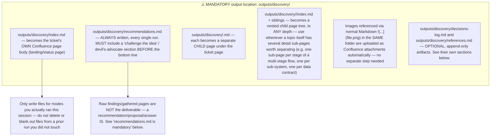

## File naming (use exactly these names so re-runs update the same Confluence page instead of creating duplicates)

| File | Mode | Content |
|------|------|---------|
| `index.md` | — | Landing page: one-paragraph status, which mode(s) ran this session, dominant risk, the headline recommendation (one line, link to full `recommendations.md`), links to the other pages below, "Last iteration" note (date + delta summary) |
| `research-brief.md` | — (optional) | Decision framing, written BEFORE other modes on an ambiguous/high-stakes first run. See `modes.md`. |
| `recommendations.md` | — (always) | **Mandatory every run.** See "recommendations.md is mandatory" below |
| `opportunity-assessment.md` | 0 | Problem / who / alternatives / why now / success metrics / go-no-go |
| `domain-brief.md` | 1 | Domain / context explainer |
| `source-distillate.md` | 2 | Lossless compression of sources |
| `discovery-plan.md` | 3 | Known vs unknown, four (or more) risks, evidence bars |
| `as-is-to-be.md` | 4 | Current vs future flow, plus a Systems/Actors Overview table (see `modes.md`) |
| `mapping.md` | 5 | Field / interface / data-contract tables |
| `prd.md` | 6 | Discovery PRD (see `modes.md` for structure). Split into `prd/business-requirements.md` + `prd/technical-requirements.md` subfolder when the two genuinely need separate stakeholder audiences (business vs engineering) and are each substantial — otherwise a single `prd.md` is fine. |
| `experiments.md` | 7 | Proposed experiments for the dominant risk, with method + measurement contract (see `decision_and_governance.md`) |
| `readiness.md` | 8 | Four-risk readiness assessment + trio check, 4-state verdict |
| `decisions-log.md` | — (optional, append-only) | Running log of questions asked, decisions made, and action items, across the whole discovery lifetime. See below. |
| `references.md` | — (optional) | Consolidated index of every external artifact/link referenced anywhere in this discovery (specs, recordings, design docs, example files, diagrams). See below. |
| `publication-review.md` | — (optional) | Only when material sensitivity/governance concerns exist (see `decision_and_governance.md`'s governance gate) — records what was checked/redacted before broad publication and any concern still open. |

Do not invent additional top-level files beyond this table — but DO create subfolders under any of these when a topic's complexity genuinely warrants splitting it into several detail pages (e.g. `as-is-to-be/<stage-name>.md` per stage of a multi-stage process, or `mapping/<system-pair-name>.md` per pair of integrated systems). A predictable page tree does not mean a shallow one — depth is fine when the topic needs it; inventing sibling top-level files that duplicate an existing file's purpose is not.

## `decisions-log.md` — optional, append-only running log

Some discoveries are not a single AI session but an ongoing thread across many real conversations/meetings over weeks or months (the ticket accumulates comments, stakeholders answer questions in follow-up rounds, new decisions get made). For this kind of discovery, maintain `outputs/discovery/decisions-log.md` as a table:

`# | Area/Topic | Question | Decision | Action Item(s) | Date/Source`

Rules:
- **Never delete or rewrite prior rows.** Each run only ever **appends** new rows for genuinely new questions/decisions surfaced this run (from new ticket comments, new stakeholder input, or new investigation findings) — this file's whole value is the historical record.
- If a prior open question now has an answer, add a **new row** referencing the old one ("see row 3") rather than editing row 3's original text — the history of "what we didn't know when" is itself useful.
- Skip creating this file entirely for a single-session, one-shot discovery with no back-and-forth — don't create an empty or one-row log just to check a box.

## `references.md` — optional, consolidated reference index

When a discovery accumulates several external artifacts (design files, recorded calls, spec documents, example data files, diagrams, third-party docs), maintain `outputs/discovery/references.md` as a single table so a reader doesn't have to hunt through every sub-page to find the source material:

`# | Artifact | Link | Comments`

This is a **discovery-wide index**, distinct from the per-file "References" section `formatting_rules.md` requires at the bottom of individual files with several citations — that per-file section stays local to its file; `references.md` is the one place that aggregates everything across the whole discovery tree. Append new rows as new artifacts surface; don't remove old ones even if a topic they relate to is later dropped from scope (mark it `_out of scope_` in the Comments column instead).

## `publication-review.md` — optional, only when a governance concern actually exists

Most discoveries don't need this file. Create it only when the source material (ticket comments, attachments, interview notes) contained something covered by `decision_and_governance.md`'s publication/sensitivity governance gate — e.g. a real person's name/contact info, a secret, an unconsented direct quote, a cross-customer comparison, or a domain-sensitive (legal/safety/compliance) conclusion. Record: what was found, what was redacted/anonymized/paraphrased, and anything that couldn't be resolved this run and still needs a human decision before broad publication.

## `recommendations.md` is mandatory

⚠️ **Write this file every single run, no matter which mode(s) you ran or how thin the ticket was.** A discovery pass that only hands back gathered facts/pages with no actual answer is incomplete — the deliverable is a recommendation, not raw research.

Required content, **in this order** (the challenge step MUST come before the bottom line is finalized — see below):

1. **Challenge the idea first** — before concluding anything, actively argue the OPPOSING case: why this should NOT be built / why "no-go" or "kill it" could be right. Required sub-questions:
   - Does this duplicate an existing feature, tool, or vendor already in use (internally or in the market) that solves the same job cheaper/faster?
   - What is the cost of doing nothing, and is it actually worse than the cost/risk of building this?
   - What's the strongest steelman argument a skeptical stakeholder would make against proceeding?
   - Only after writing this section does the bottom line get decided — if the challenge case is stronger than the case for proceeding, the bottom line MUST reflect that (no-go / kill / defer), not a "go" reached by ignoring your own challenge.
2. **Bottom line** (one sentence): go / explore-further / no-go, or — for a feature/task-shaped ticket — build it / don't build it / build a smaller version, stated as a direct answer, not a hedge, and consistent with the challenge section above.
3. **Proposal** — the specific direction being recommended: which feature/approach/technology/next step, in concrete terms a stakeholder could act on today (not "we should look into options"). Use a numbered list or table for a multi-step proposal (phase | timeline | outcome) — Mermaid is NOT the default here (see `formatting_rules.md`'s Mermaid caveat).
4. **Why** — the 2-4 findings (from your investigation — web research, codebase, linked docs) that most drove the recommendation, each with a real Markdown link to its source.
5. **Evidence against** — the material counter-evidence you found (see `evidence_and_methods.md`'s "Searching for evidence against") even if it didn't change the bottom line — do not suppress a contradiction just to make the recommendation read cleaner.
6. **Answers to open questions** — for every open question you would otherwise raise, give your best-supported answer/hypothesis first (labeled `**Recommended answer:**`, with rationale and confidence), and only fall back to a bare unresolved "Open question — needs human input" for the genuinely undecidable ones (e.g. depends on a business decision, budget, or legal/compliance call no source can answer). A table (question | recommended answer | confidence | source) is preferred over prose.
7. **What could change the recommendation** — the specific new evidence that would flip it (keeps the recommendation honest and falsifiable, not just an opinion).

This is not the same as "no invention" (see `general_guidelines.md`) — a recommendation is explicitly your reasoned judgment call, clearly labeled as such, built on the facts you gathered. Labeling it as a recommendation (not a fact) is what keeps it honest. The challenge step exists specifically to counter confirmation bias — do not skip it or treat it as a formality to get through before writing the "real" (positive) recommendation.

## Cross-linking

Link between your own files with plain relative Markdown links, e.g. `[see the PRD](prd.md)` or `[mapping details](mapping.md)` — the Confluence sync step rewrites these into real Confluence page links automatically. Do not use absolute file paths or guess Confluence page IDs yourself.

## Re-runs / iteration

⚠️ **On an iteration run, `outputs/discovery/` is NOT empty when you start** — the pre-CLI step seeds it with the last published Confluence content, recursively at every depth of the existing page tree (same file/subfolder naming as the table above), before you run. **Read what's already there first, including any nested subfolders.** Then **edit the same file in place** with the merged result (old content + this run's delta) rather than deleting it and starting fresh — this keeps the same Confluence page updated instead of creating a duplicate tree, and guarantees nothing you didn't intend to touch gets silently dropped. This applies to `recommendations.md` too: re-affirm, sharpen, or revise the recommendation based on any new artefact — don't leave a stale recommendation unexamined.

**Exception — append-only files:** `decisions-log.md` and `references.md` are never rewritten wholesale on iteration, even though they're seeded the same way as everything else. Read their existing rows, then only **append** new rows for what this run actually added — see their own sections above for why (they're a historical record, not current-state).
