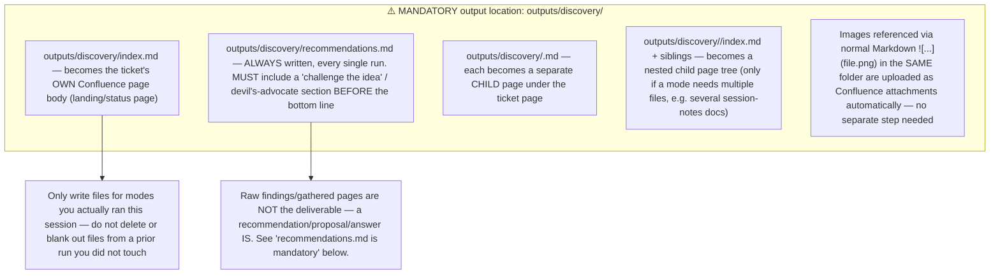

## File naming (use exactly these names so re-runs update the same Confluence page instead of creating duplicates)

| File | Mode | Content |
|------|------|---------|
| `index.md` | — | Landing page: one-paragraph status, which mode(s) ran this session, dominant risk, the headline recommendation (one line, link to full `recommendations.md`), links to the other pages below, "Last iteration" note (date + delta summary) |
| `recommendations.md` | — (always) | **Mandatory every run.** See "recommendations.md is mandatory" below |
| `opportunity-assessment.md` | 0 | Problem / who / alternatives / why now / success metrics / go-no-go |
| `domain-brief.md` | 1 | Domain / context explainer |
| `source-distillate.md` | 2 | Lossless compression of sources |
| `discovery-plan.md` | 3 | Known vs unknown, four risks, evidence bars |
| `as-is-to-be.md` | 4 | Current vs future flow |
| `mapping.md` | 5 | Field / interface / data-contract tables |
| `prd.md` | 6 | Discovery PRD (see modes.md for structure) |
| `experiments.md` | 7 | Proposed experiments for the dominant risk |
| `readiness.md` | 8 | Four-risk readiness assessment + trio check |

Do not invent additional top-level files beyond this table unless a mode genuinely needs a nested folder (e.g. multiple session-notes documents) — keep the page tree predictable.

## `recommendations.md` is mandatory

⚠️ **Write this file every single run, no matter which mode(s) you ran or how thin the ticket was.** A discovery pass that only hands back gathered facts/pages with no actual answer is incomplete — the deliverable is a recommendation, not raw research.

Required content, **in this order** (the challenge step MUST come before the bottom line is finalized — see below):

1. **Challenge the idea first** — before concluding anything, actively argue the OPPOSING case: why this should NOT be built / why "no-go" or "kill it" could be right. Required sub-questions:
   - Does this duplicate an existing feature, tool, or vendor already in use (internally or in the market) that solves the same job cheaper/faster?
   - What is the cost of doing nothing, and is it actually worse than the cost/risk of building this?
   - What's the strongest steelman argument a skeptical stakeholder would make against proceeding?
   - Only after writing this section does the bottom line get decided — if the challenge case is stronger than the case for proceeding, the bottom line MUST reflect that (no-go / kill / defer), not a "go" reached by ignoring your own challenge.
2. **Bottom line** (one sentence): go / explore-further / no-go, or — for a feature/task-shaped ticket — build it / don't build it / build a smaller version, stated as a direct answer, not a hedge, and consistent with the challenge section above.
3. **Proposal** — the specific direction being recommended: which feature/approach/technology/next step, in concrete terms a stakeholder could act on today (not "we should look into options"). Use a numbered list or table for a multi-step proposal (phase | timeline | outcome) — Mermaid is NOT the default here (see `formatting_rules.md`'s Mermaid caveat).
4. **Why** — the 2-4 findings (from your investigation — web research, codebase, linked docs) that most drove the recommendation, each with a real Markdown link to its source.
5. **Answers to open questions** — for every open question you would otherwise raise, give your best-supported answer/hypothesis first (labeled `**Recommended answer:**`, with rationale and confidence), and only fall back to a bare unresolved "Open question — needs human input" for the genuinely undecidable ones (e.g. depends on a business decision, budget, or legal/compliance call no source can answer). A table (question | recommended answer | confidence | source) is preferred over prose.
6. **What could change the recommendation** — the specific new evidence that would flip it (keeps the recommendation honest and falsifiable, not just an opinion).

This is not the same as "no invention" (see `general_guidelines.md`) — a recommendation is explicitly your reasoned judgment call, clearly labeled as such, built on the facts you gathered. Labeling it as a recommendation (not a fact) is what keeps it honest. The challenge step exists specifically to counter confirmation bias — do not skip it or treat it as a formality to get through before writing the "real" (positive) recommendation.

## Cross-linking

Link between your own files with plain relative Markdown links, e.g. `[see the PRD](prd.md)` or `[mapping details](mapping.md)` — the Confluence sync step rewrites these into real Confluence page links automatically. Do not use absolute file paths or guess Confluence page IDs yourself.

## Re-runs / iteration

⚠️ **On an iteration run, `outputs/discovery/` is NOT empty when you start** — the pre-CLI step seeds it with the last published Confluence content (one file per page, same naming as the table above) before you run. **Read what's already there first.** Then **edit the same file in place** with the merged result (old content + this run's delta) rather than deleting it and starting fresh — this keeps the same Confluence page updated instead of creating a duplicate tree, and guarantees nothing you didn't intend to touch gets silently dropped. This applies to `recommendations.md` too: re-affirm, sharpen, or revise the recommendation based on any new artefact — don't leave a stale recommendation unexamined.
