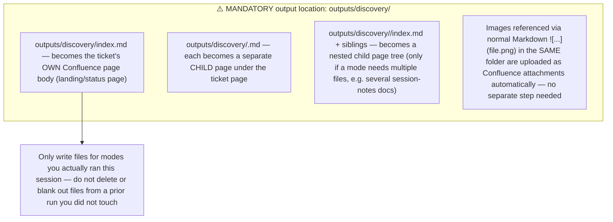

## File naming (use exactly these names so re-runs update the same Confluence page instead of creating duplicates)

| File | Mode | Content |
|------|------|---------|
| `index.md` | — | Landing page: one-paragraph status, which mode(s) ran this session, dominant risk, links to the other pages below, "Last iteration" note (date + delta summary) |
| `opportunity-assessment.md` | 0 | Problem / who / alternatives / why now / success metrics / go-no-go |
| `domain-brief.md` | 1 | Domain / context explainer |
| `source-distillate.md` | 2 | Lossless compression of sources |
| `discovery-plan.md` | 3 | Known vs unknown, four risks, evidence bars |
| `as-is-to-be.md` | 4 | Current vs future flow |
| `mapping.md` | 5 | Field / interface / data-contract tables |
| `prd.md` | 6 | Discovery PRD (see modes.md for structure) |
| `experiments.md` | 7 | Proposed experiments for the dominant risk |
| `readiness.md` | 8 | Four-risk readiness assessment + trio check |

Do not invent additional top-level files beyond this table unless a mode genuinely needs a nested folder (e.g. multiple session-notes documents) — keep the page tree predictable.

## Cross-linking

Link between your own files with plain relative Markdown links, e.g. `[see the PRD](prd.md)` or `[mapping details](mapping.md)` — the Confluence sync step rewrites these into real Confluence page links automatically. Do not use absolute file paths or guess Confluence page IDs yourself.

## Re-runs / iteration

If `input/discovery-context/index.md` (and siblings) exist, they are the **last published state** of these same files. Read them, then **update the same file in place** with the merged result (old content + this run's delta) rather than starting a new file — this keeps the same Confluence page updated instead of creating a duplicate tree.
