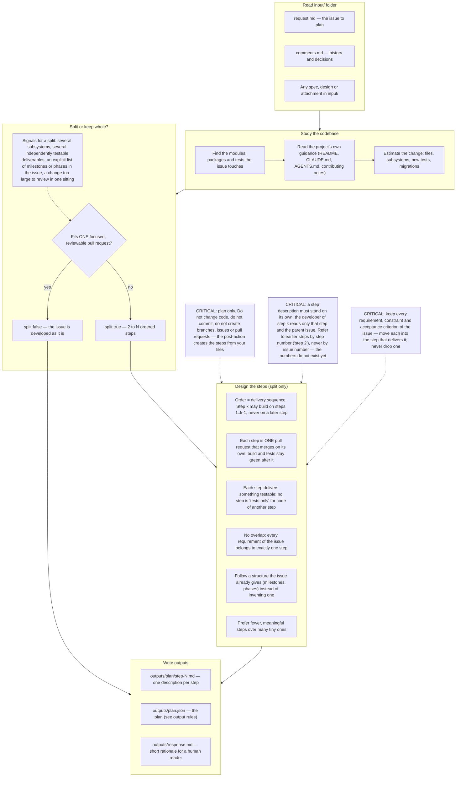

```mermaid
flowchart TD
    subgraph INPUT["Read input/ folder"]
        I1["request.md — the issue to plan"]
        I2["comments.md — history and decisions"]
        I3["Any spec, design or attachment in input/"]
    end

    subgraph STUDY["Study the codebase"]
        S1["Find the modules, packages and tests the issue touches"]
        S2["Read the project's own guidance (README, CLAUDE.md, AGENTS.md, contributing notes)"]
        S3["Estimate the change: files, subsystems, new tests, migrations"]
        S1 --> S2 --> S3
    end

    subgraph DECIDE["Split or keep whole?"]
        D1{"Fits ONE focused, reviewable pull request?"}
        D1 -->|yes| KEEP["split:false — the issue is developed as it is"]
        D1 -->|no| SPLIT["split:true — 2 to N ordered steps"]
        D2["Signals for a split: several subsystems, several independently testable deliverables, an explicit list of milestones or phases in the issue, a change too large to review in one sitting"]
        D2 -.-> D1
    end

    subgraph STEPS["Design the steps (split only)"]
        P1["Order = delivery sequence. Step k may build on steps 1..k-1, never on a later step"]
        P2["Each step is ONE pull request that merges on its own: build and tests stay green after it"]
        P3["Each step delivers something testable; no step is 'tests only' for code of another step"]
        P4["No overlap: every requirement of the issue belongs to exactly one step"]
        P5["Follow a structure the issue already gives (milestones, phases) instead of inventing one"]
        P6["Prefer fewer, meaningful steps over many tiny ones"]
    end

    subgraph WRITE["Write outputs"]
        W1["outputs/plan/step-N.md — one description per step"]
        W2["outputs/plan.json — the plan (see output rules)"]
        W3["outputs/response.md — short rationale for a human reader"]
    end

    INPUT --> STUDY --> DECIDE
    SPLIT --> STEPS --> WRITE
    KEEP --> WRITE

    CR1["CRITICAL: plan only. Do not change code, do not commit, do not create branches, issues or pull requests — the post-action creates the steps from your files"]
    CR2["CRITICAL: a step description must stand on its own: the developer of step k reads only that step and the parent issue. Refer to earlier steps by step number ('step 2'), never by issue number — the numbers do not exist yet"]
    CR3["CRITICAL: keep every requirement, constraint and acceptance criterion of the issue — move each into the step that delivers it; never drop one"]
    CR1 -.-> STEPS
    CR2 -.-> STEPS
    CR3 -.-> STEPS
```
