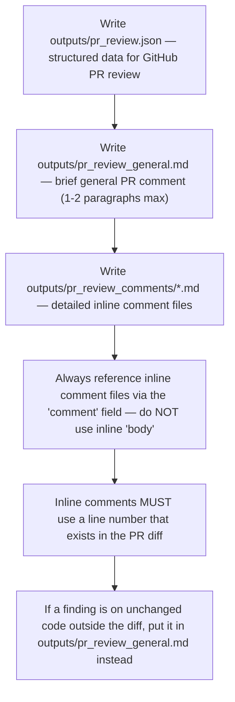

```mermaid
flowchart TD
    O1["Write outputs/pr_review.json — structured data for GitHub PR review"]
    O2["Write outputs/pr_review_general.md — brief general PR comment (1-2 paragraphs max)"]
    O3["Write outputs/pr_review_comments/*.md — detailed inline comment files"]
    O4["Always reference inline comment files via the 'comment' field — do NOT use inline 'body'"]
    O5["Inline comments MUST use a line number that exists in the PR diff"]
    O6["If a finding is on unchanged code outside the diff, put it in outputs/pr_review_general.md instead"]
    O1 --> O2 --> O3 --> O4 --> O5 --> O6
```
