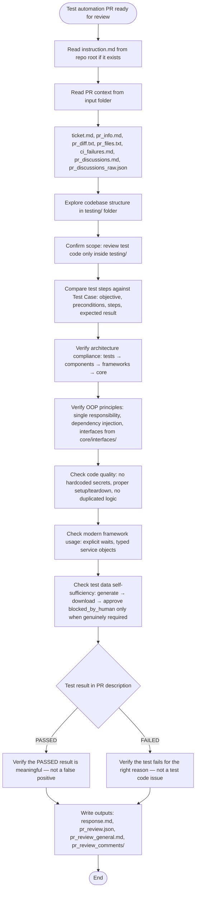

```mermaid
flowchart TD
    START([Test automation PR ready for review]) --> PROJ["Read instruction.md from repo root if it exists"]
    PROJ --> INPUT["Read PR context from input folder"]
    INPUT --> INPUTS["ticket.md, pr_info.md, pr_diff.txt, pr_files.txt, ci_failures.md, pr_discussions.md, pr_discussions_raw.json"]
    INPUTS --> EXPLORE["Explore codebase structure in testing/ folder"]
    EXPLORE --> SCOPE["Confirm scope: review test code only inside testing/"]
    SCOPE --> CORRECT["Compare test steps against Test Case: objective, preconditions, steps, expected result"]
    CORRECT --> ARCH["Verify architecture compliance: tests → components → frameworks → core"]
    ARCH --> OOP["Verify OOP principles: single responsibility, dependency injection, interfaces from core/interfaces/"]
    OOP --> QUALITY["Check code quality: no hardcoded secrets, proper setup/teardown, no duplicated logic"]
    QUALITY --> MODERN["Check modern framework usage: explicit waits, typed service objects"]
    MODERN --> DATA["Check test data self-sufficiency: generate → download → approve blocked_by_human only when genuinely required"]
    DATA --> RESULT{Test result in PR description}
    RESULT -->|PASSED| PASSED_REVIEW["Verify the PASSED result is meaningful — not a false positive"]
    RESULT -->|FAILED| FAILED_REVIEW["Verify the test fails for the right reason — not a test code issue"]
    PASSED_REVIEW --> OUTPUT[Write outputs: response.md, pr_review.json, pr_review_general.md, pr_review_comments/]
    FAILED_REVIEW --> OUTPUT
    OUTPUT --> END([End])
```
