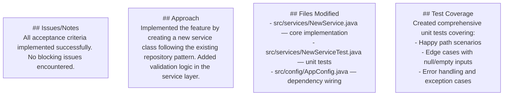

```mermaid
flowchart TD
    E1["## Issues/Notes<br/>All acceptance criteria implemented successfully. No blocking issues encountered."]
    E2["## Approach<br/>Implemented the feature by creating a new service class following the existing repository pattern. Added validation logic in the service layer."]
    E3["## Files Modified<br/>- src/services/NewService.java — core implementation<br/>- src/services/NewServiceTest.java — unit tests<br/>- src/config/AppConfig.java — dependency wiring"]
    E4["## Test Coverage<br/>Created comprehensive unit tests covering:<br/>- Happy path scenarios<br/>- Edge cases with null/empty inputs<br/>- Error handling and exception cases"]
```
