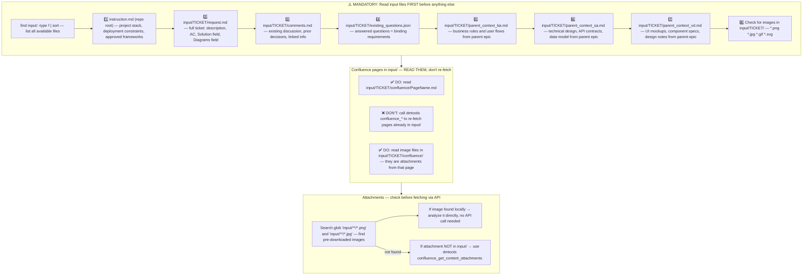

```mermaid
flowchart TD
    subgraph INPUT_ORDER["⚠️ MANDATORY: Read input files FIRST before anything else"]
        I0["find input/ -type f | sort — list all available files"]
        I1["1️⃣ instruction.md (repo root) — project stack, deployment constraints, approved frameworks"]
        I2["2️⃣ input/TICKET/request.md — full ticket: description, AC, Solution field, Diagrams field"]
        I3["3️⃣ input/TICKET/comments.md — existing discussion, prior decisions, linked info"]
        I4["4️⃣ input/TICKET/existing_questions.json — answered questions = binding requirements"]
        I5["5️⃣ input/TICKET/parent_context_ba.md — business rules and user flows from parent epic"]
        I6["6️⃣ input/TICKET/parent_context_sa.md — technical design, API contracts, data model from parent epic"]
        I7["7️⃣ input/TICKET/parent_context_vd.md — UI mockups, component specs, design notes from parent epic"]
        I8["8️⃣ Check for images in input/TICKET/ — *.png *.jpg *.gif *.svg"]
        I0 --> I1 --> I2 --> I3 --> I4 --> I5 --> I6 --> I7 --> I8
    end

    subgraph CONFLUENCE_RULE["Confluence pages in input/ — READ THEM, don't re-fetch"]
        C1["✅ DO: read input/TICKET/confluence/PageName.md"]
        C2["❌ DON'T: call dmtools confluence_* to re-fetch pages already in input/"]
        C3["✅ DO: read image files in input/TICKET/confluence/ — they are attachments from that page"]
    end

    subgraph ATTACH_RULE["Attachments — check before fetching via API"]
        A1["Search glob 'input/**/*.png' and 'input/**/*.jpg' — find pre-downloaded images"]
        A2["If image found locally → analyze it directly, no API call needed"]
        A3["If attachment NOT in input/ → use dmtools confluence_get_content_attachments <id>"]
        A1 --> A2
        A1 -->|not found| A3
    end

    INPUT_ORDER --> CONFLUENCE_RULE --> ATTACH_RULE
```
