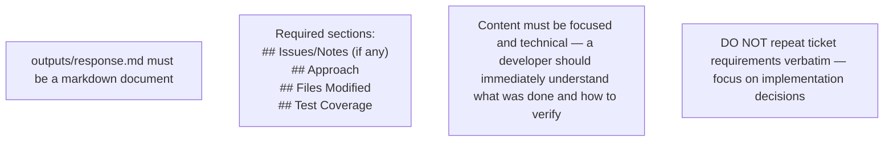

```mermaid
flowchart TD
    F1["outputs/response.md must be a markdown document"]
    F2["Required sections:<br/>## Issues/Notes (if any)<br/>## Approach<br/>## Files Modified<br/>## Test Coverage"]
    F3["Content must be focused and technical — a developer should immediately understand what was done and how to verify"]
    F4["DO NOT repeat ticket requirements verbatim — focus on implementation decisions"]
```
