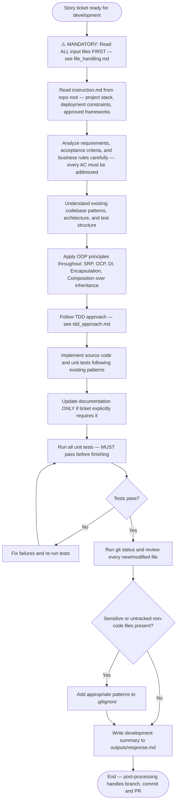

```mermaid
flowchart TD
    START([Story ticket ready for development]) --> READ_INPUT["⚠️ MANDATORY: Read ALL input files FIRST — see file_handling.md"]
    READ_INPUT --> PROJ["Read instruction.md from repo root — project stack, deployment constraints, approved frameworks"]
    PROJ --> REQ["Analyze requirements, acceptance criteria, and business rules carefully — every AC must be addressed"]
    REQ --> ARCH["Understand existing codebase patterns, architecture, and test structure"]
    ARCH --> PRINCIPLES["Apply OOP principles throughout: SRP, OCP, DI, Encapsulation, Composition over inheritance"]
    PRINCIPLES --> TDD["Follow TDD approach — see tdd_approach.md"]
    TDD --> IMPLEMENT["Implement source code and unit tests following existing patterns"]
    IMPLEMENT --> DOCS["Update documentation ONLY if ticket explicitly requires it"]
    DOCS --> RUN["Run all unit tests — MUST pass before finishing"]
    RUN --> PASS{Tests pass?}
    PASS -->|No| FIX["Fix failures and re-run tests"]
    FIX --> RUN
    PASS -->|Yes| GITSTATUS["Run git status and review every new/modified file"]
    GITSTATUS --> SECRETS{Sensitive or untracked non-code files present?}
    SECRETS -->|Yes| IGNORE["Add appropriate patterns to .gitignore"]
    SECRETS -->|No| SUMMARY["Write development summary to outputs/response.md"]
    IGNORE --> SUMMARY
    SUMMARY --> END([End — post-processing handles branch, commit and PR])
```
