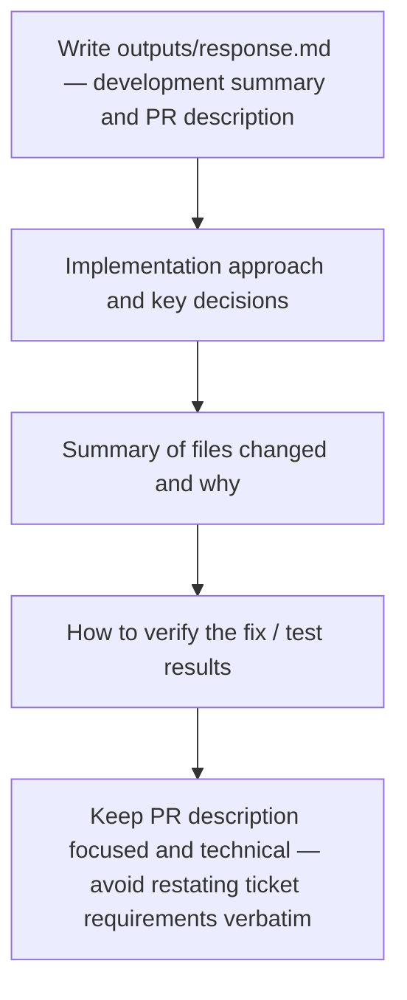

```mermaid
flowchart TD
    O1["Write outputs/response.md — development summary and PR description"]
    O2["Implementation approach and key decisions"]
    O3["Summary of files changed and why"]
    O4["How to verify the fix / test results"]
    O5["Keep PR description focused and technical — avoid restating ticket requirements verbatim"]
    O1 --> O2 --> O3 --> O4 --> O5
```
