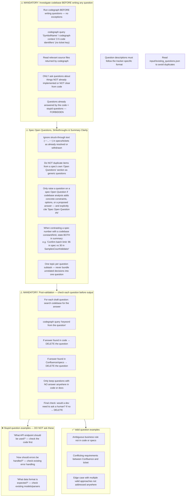

```mermaid
flowchart TD
    G1["Question descriptions must follow the tracker-specific format"]
    G4["Read input/<ISSUE_KEY>/existing_questions.json to avoid duplicates"]

    subgraph CODEGRAPH["⚠️ MANDATORY: Investigate codebase BEFORE writing any question"]
        CG1["Run codegraph BEFORE writing questions — no exceptions"]
        CG2["codegraph query 'SymbolName' / codegraph context '2-5 code identifiers' (no ticket key)"]
        CG3["Read relevant source files returned by codegraph"]
        CG4["ONLY ask questions about things NOT already implemented or NOT clear from code"]
        CG5["Questions already answered by the code = stupid questions — FORBIDDEN"]
    end

    subgraph SPEC_HYGIENE["⚠️ Spec Open Questions, Strikethroughs & Summary Clarity"]
        SH1["Ignore struck-through text (~~...~~) in specs/tickets as already resolved or withdrawn"]
        SH2["Do NOT duplicate items from a spec's own 'Open Questions' section as generic questions"]
        SH3["Only raise a question on a spec Open Question if codebase analysis adds concrete constraints, options, or a proposed answer — and explicitly cite 'Spec Open Question #N'"]
        SH4["When contrasting a spec number with a codebase constant/limit, state BOTH in summary:<br/>e.g. 'Confirm batch limit: 96 in spec vs 30 in SamplesCountValidator'"]
        SH5["One topic per question subtask — never bundle unrelated decisions into one question"]
    end

    subgraph VALIDATE["⚠️ MANDATORY: Post-validation — check each question before output"]
        V1["For each draft question: search codebase for the answer"]
        V2["codegraph query 'keyword from the question'"]
        V3["If answer found in code → DELETE the question"]
        V4["If answer found in Confluence/specs → DELETE the question"]
        V5["Only keep questions with NO answer anywhere in code or docs"]
        V6["Final check: would a dev need to ask a human? If no → DELETE"]
    end

    subgraph BAD["❌ Stupid question examples — DO NOT ask these"]
        B1["'What API endpoint should be used?' — check the code first"]
        B2["'How should errors be handled?' — check existing error handling"]
        B3["'What data format is expected?' — check existing models/parsers"]
    end

    subgraph GOOD["✅ Valid question examples"]
        GQ1["Ambiguous business rule not in code or specs"]
        GQ2["Conflicting requirements between Confluence and ticket"]
        GQ3["Edge case with multiple valid approaches not addressed anywhere"]
    end

    CODEGRAPH --> SPEC_HYGIENE --> VALIDATE --> BAD
    VALIDATE --> GOOD
```
