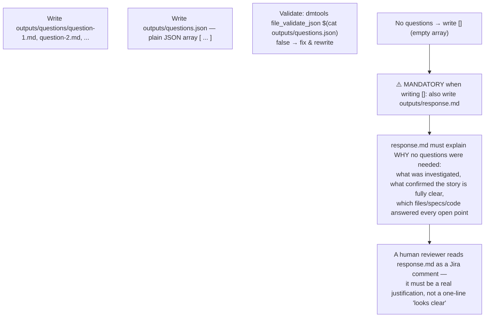

```mermaid
flowchart TD
    O1["Write outputs/questions/question-1.md, question-2.md, ..."]
    O2["Write outputs/questions.json — plain JSON array [ ... ]"]
    O3["Validate: dmtools file_validate_json $(cat outputs/questions.json)<br/>false → fix & rewrite"]
    O4["No questions → write [] (empty array)"]
    O4 --> O5["⚠️ MANDATORY when writing []: also write outputs/response.md"]
    O5 --> O6["response.md must explain WHY no questions were needed:<br/>what was investigated, what confirmed the story is fully clear,<br/>which files/specs/code answered every open point"]
    O6 --> O7["A human reviewer reads response.md as a Jira comment —<br/>it must be a real justification, not a one-line 'looks clear'"]
```

