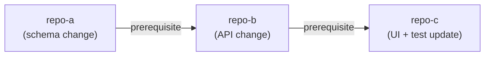

# Affected Repositories Output

## Purpose

After writing the solution design, produce `outputs/affected_repos.json` — a structured
list of every repository where code, configuration, migrations, or schema changes are needed.
This file is consumed by the post-action script to label the Jira ticket and generate a
visual dependency map.

---

## Output format

```json
[
  {
    "name": "repo-a",
    "reason": "Short explanation of what must change and why."
  },
  {
    "name": "repo-b",
    "reason": "Short explanation of what must change and why."
  },
  {
    "name": "repo-c",
    "reason": "Depends on schema from repo-a and API from repo-b.",
    "depends_on": ["repo-a", "repo-b"]
  }
]
```

| Field | Required | Description |
| --- | --- | --- |
| `name` | ✅ | Exact short repository name (no org prefix, no URL). |
| `reason` | ✅ | One sentence: what changes and why it is needed. |
| `depends_on` | ☐ | Names of other affected repos that must be completed first. Omit if no ordering constraint. |

---

## How to determine affected repositories

Include a repository when any of the following are true:

- Source code must be added or modified (new endpoint, new model field, new UI component, etc.)
- Database schema or migration script must be created
- Configuration or environment variable must be added
- API contract change requires the consumer to adapt
- Test suite must be updated to cover new behaviour

**Do NOT include** repositories that are only read at runtime (no code changes needed),
or that are affected only indirectly through a shared library version bump that requires
no code change.

---

## Dependency chain — Mermaid illustration

The `depends_on` field expresses a *must complete before* ordering constraint.
Use it whenever a change in one repo cannot be deployed or tested without a
prior change in another. The post-action renders the chain as:



Generate this diagram inside your solution design (in `outputs/diagram.md` or
as a dedicated section) whenever three or more repositories form a chain.

---

## Empty result

If the solution requires no repository changes (pure configuration, Jira-only update, etc.):

```json
[]
```
