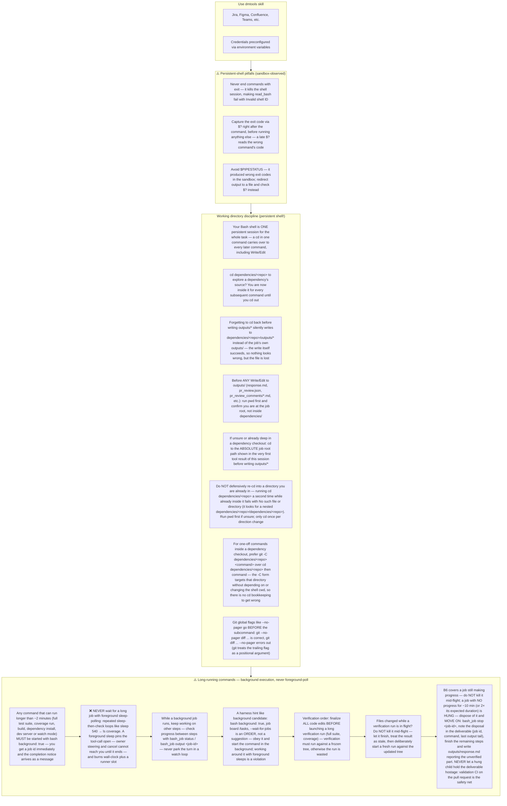

```mermaid
flowchart TD
    subgraph USE["Use dmtools skill"]
        U1["Jira, Figma, Confluence, Teams, etc."]
        U2["Credentials preconfigured via environment variables"]
    end

    subgraph SHELLSTATE["⚠️ Persistent-shell pitfalls (sandbox-observed)"]
        P1["Never end commands with exit — it kills the shell session, making read_bash fail with Invalid shell ID"]
        P2["Capture the exit code via $? right after the command, before running anything else — a late $? reads the wrong command's code"]
        P3["Avoid $PIPESTATUS — it produced wrong exit codes in the sandbox; redirect output to a file and check $? instead"]
    end

    subgraph CWD["Working directory discipline (persistent shell!)"]
        C1["Your Bash shell is ONE persistent session for the whole task — a cd in one command carries over to every later command, including Write/Edit"]
        C2["cd dependencies/&lt;repo&gt; to explore a dependency's source? You are now inside it for every subsequent command until you cd out"]
        C3["Forgetting to cd back before writing outputs/* silently writes to dependencies/&lt;repo&gt;/outputs/* instead of the job's own outputs/ — the write itself succeeds, so nothing looks wrong, but the file is lost"]
        C4["Before ANY Write/Edit to outputs/ (response.md, pr_review.json, pr_review_comments/*.md, etc.): run pwd first and confirm you are at the job root, not inside dependencies/"]
        C5["If unsure or already deep in a dependency checkout: cd to the ABSOLUTE job root path shown in the very first tool result of this session before writing outputs/*"]
        C6["Do NOT defensively re-cd into a directory you are already in — running cd dependencies/&lt;repo&gt; a second time while already inside it fails with No such file or directory (it looks for a nested dependencies/&lt;repo&gt;/dependencies/&lt;repo&gt;). Run pwd first if unsure; only cd once per direction change"]
        C7["For one-off commands inside a dependency checkout, prefer git -C dependencies/&lt;repo&gt; &lt;command&gt; over cd dependencies/&lt;repo&gt; then command — the -C form targets that directory without depending on or changing the shell cwd, so there is no cd bookkeeping to get wrong"]
        C8["Git global flags like --no-pager go BEFORE the subcommand: git --no-pager diff ... is correct, git diff ... --no-pager errors out (git treats the trailing flag as a positional argument)"]
    end

    subgraph BGJOBS["⚠️ Long-running commands — background execution, never foreground-poll"]
        B1["Any command that can run longer than ~2 minutes (full test suite, coverage run, build, dependency install, dev server or watch mode) MUST be started with bash background: true — you get a job id immediately and the completion notice arrives as a message"]
        B2["❌ NEVER wait for a long job with foreground sleep-polling: repeated sleep-then-check loops like sleep 540 → ls coverage. A foreground sleep pins the tool-call open — owner steering and cancel cannot reach you until it ends — and burns wall-clock plus a runner slot"]
        B3["While a background job runs, keep working on other steps — check progress between steps with bash_job status / bash_job output &lt;job-id&gt; — never park the turn in a watch loop"]
        B4["A harness hint like background candidate: bash background: true, job board /tasks, --wait-for-jobs is an ORDER, not a suggestion — obey it and start the command in the background; working around it with foreground sleeps is a violation"]
        B5["Verification order: finalize ALL code edits BEFORE launching a long verification run (full suite, coverage) — verification must run against a frozen tree, otherwise the run is wasted"]
        B6["Files changed while a verification run is in flight? Do NOT kill it mid-flight — let it finish, treat the result as stale, then deliberately start a fresh run against the updated tree"]
        B7["B6 covers a job still making progress — do NOT kill it mid-flight; a job with NO progress for ~10 min (or 2× its expected duration) is HUNG — dispose of it and MOVE ON: bash_job stop &lt;job-id&gt;, note the disposal in the deliverable (job id, command, last output tail), finish the remaining steps and write outputs/response.md reporting the unverified part. NEVER let a hung child hold the deliverable hostage: validation CI on the pull request is the safety net"]
        B1 --> B2 --> B3 --> B4 --> B5 --> B6 --> B7
    end

    USE --> SHELLSTATE
    SHELLSTATE --> CWD
    CWD --> BGJOBS
```
