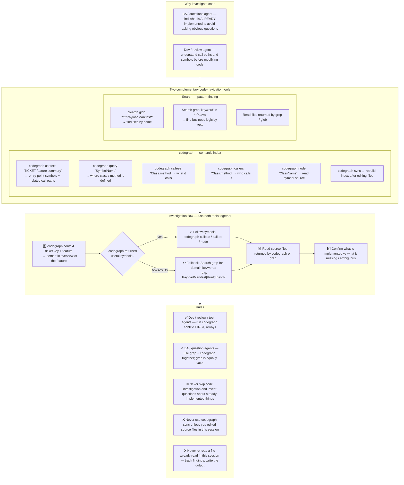

**HARD GATE — read before any tool call:**

1. Your FIRST code-investigation action MUST be `codegraph context "<ticket key> <feature summary>"` — before any grep / glob / file read of source code.
2. Keep a running mental list of files you have already read and facts you have already established. **Never re-read a file or re-run a search you already did in this session** — quote your earlier finding instead. Re-reading the same file twice means your investigation is looping; stop investigating and start writing the output.
3. If codegraph returns nothing useful, fall back to a few targeted grep/glob searches — but cap the fallback: after ~10 search calls you have enough to write the deliverable. Do not turn the fallback into a search loop.

