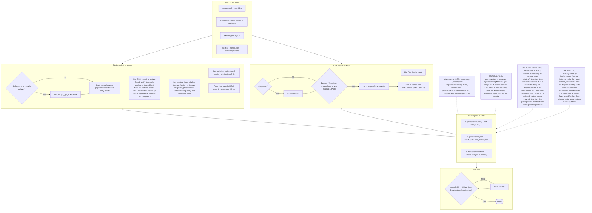

```mermaid
flowchart TD
    subgraph INPUT["Read input/ folder"]
        I1["request.md — raw idea"]
        I2["comments.md — history & decisions"]
        I3["existing_epics.json"]
        I4["existing_stories.json — avoid duplicates"]
    end

    subgraph ATTACH["Check attachments"]
        A1["List ALL files in input/"]
        A2{".zip present?"}
        A2 -->|yes| A3["unzip -d input/"]
        A2 -->|no| A4{"Relevant? designs, screenshots, specs, mockups, PDFs"}
        A3 --> A4
        A4 -->|yes| A5["cp → outputs/attachments/"]
        A5 --> A6["Mark in stories.json attachments: [path1, path2]"]
    end

    subgraph STUDY["Study project structure"]
        S1["Read existing_epics.json & existing_stories.json fully"]
        S2{"Ambiguous or closely related?"}
        S2 -->|yes| S3["dmtools jira_get_ticket KEY"]
        S2 -->|no| S4["Build mental map of pages/flows/features & entry points"]
        S3 --> S4
        S4 --> S5["For EACH existing feature found: verify it actually works end-to-end (real flow, not just 'file exists') AND has full test coverage — code presence alone is not completion"]
        S5 --> S6["Any existing feature failing that verification → its own Bug/Story (broken flow and/or missing tests), not assumed done"]
        S6 --> S7["Only then identify NEW gaps & create new tickets"]
    end

    subgraph OUTPUT["Decompose & write"]
        O1["outputs/stories/story-1.md, story-2.md, ..."]
        O2["outputs/stories.json — valid JSON array ticket plan"]
        O3["outputs/comment.md — intake analysis summary"]
    end

    subgraph VALIDATE["Validate"]
        V1{"dmtools file_validate_json $(cat outputs/stories.json)"} -->|false| V2["Fix & rewrite"] --> V1
        V1 -->|true| DONE([Done])
    end

    F1["attachments JSON: {summary: ..., description: outputs/stories/story-1.md, attachments: [outputs/attachments/design.png, outputs/attachments/spec.pdf]}"]

    CR1["CRITICAL: Tech prerequisites → separate epics/stories | Max 5SP per story | No duplicate content | No water in descriptions | MVP thinking always | Follow all input instructions exactly"]
    CR2["CRITICAL: Stories MUST be Testable. If a story cannot realistically be covered by an autotest/integration test: either don't create it as a separate story, OR explicitly state in its description 'No integration testing required — must be skipped, no test cases required, this story is a prerequisite'. Unit tests are still required regardless."]
    CR3["CRITICAL: For existing/already-implemented Android features, verify they work correctly end-to-end AND are fully covered by tests — do not assume completion just because the code/module exists. Gaps found (broken flow, missing tests) become their own Bug/Story."]

    INPUT --> STUDY
    INPUT --> ATTACH
    STUDY --> OUTPUT
    ATTACH --> OUTPUT
    OUTPUT --> VALIDATE
    F1 -.-> OUTPUT
    CR1 -.-> OUTPUT
    CR2 -.-> OUTPUT
    CR3 -.-> OUTPUT
```
