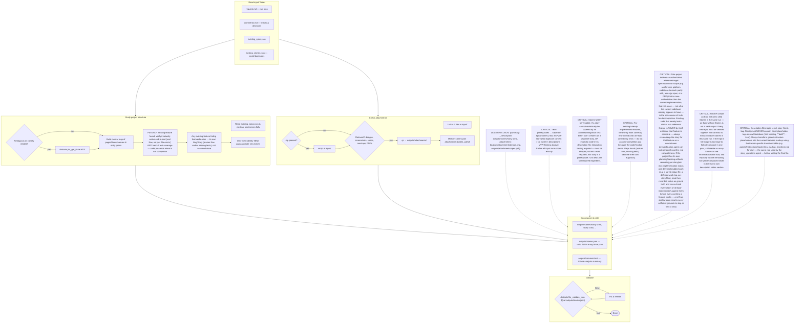

```mermaid
flowchart TD
    subgraph INPUT["Read input/ folder"]
        I1["request.md — raw idea"]
        I2["comments.md — history & decisions"]
        I3["existing_epics.json"]
        I4["existing_stories.json — avoid duplicates"]
    end

    subgraph ATTACH["Check attachments"]
        A1["List ALL files in input/"]
        A2{".zip present?"}
        A2 -->|yes| A3["unzip -d input/"]
        A2 -->|no| A4{"Relevant? designs, screenshots, specs, mockups, PDFs"}
        A3 --> A4
        A4 -->|yes| A5["cp → outputs/attachments/"]
        A5 --> A6["Mark in stories.json attachments: [path1, path2]"]
    end

    subgraph STUDY["Study project structure"]
        S1["Read existing_epics.json & existing_stories.json fully"]
        S2{"Ambiguous or closely related?"}
        S2 -->|yes| S3["dmtools jira_get_ticket KEY"]
        S2 -->|no| S4["Build mental map of pages/flows/features & entry points"]
        S3 --> S4
        S4 --> S5["For EACH existing feature found: verify it actually works end-to-end (real flow, not just 'file exists') AND has full test coverage — code presence alone is not completion"]
        S5 --> S6["Any existing feature failing that verification → its own Bug/Story (broken flow and/or missing tests), not assumed done"]
        S6 --> S7["Only then identify NEW gaps & create new tickets"]
    end

    subgraph OUTPUT["Decompose & write"]
        O1["outputs/stories/story-1.md, story-2.md, ..."]
        O2["outputs/stories.json — valid JSON array ticket plan"]
        O3["outputs/comment.md — intake analysis summary"]
    end

    subgraph VALIDATE["Validate"]
        V1{"dmtools file_validate_json $(cat outputs/stories.json)"} -->|false| V2["Fix & rewrite"] --> V1
        V1 -->|true| DONE([Done])
    end

    F1["attachments JSON: {summary: ..., description: outputs/stories/story-1.md, attachments: [outputs/attachments/design.png, outputs/attachments/spec.pdf]}"]

    CR1["CRITICAL: Tech prerequisites → separate epics/stories | Max 5SP per story | No duplicate content | No water in descriptions | MVP thinking always | Follow all input instructions exactly"]
    CR2["CRITICAL: Stories MUST be Testable. If a story cannot realistically be covered by an autotest/integration test: either don't create it as a separate story, OR explicitly state in its description 'No integration testing required — must be skipped, no test cases required, this story is a prerequisite'. Unit tests are still required regardless."]
    CR3["CRITICAL: For existing/already-implemented features, verify they work correctly end-to-end AND are fully covered by tests — do not assume completion just because the code/module exists. Gaps found (broken flow, missing tests) become their own Bug/Story."]
    CR4["CRITICAL: If the project defines an authoritative reference/target specification for scope (e.g. a reference platform codebase to reach parity with, a design spec, or a PRD) that is more authoritative than the current implementation, that reference — not what the current codebase already appears to have — is the sole source of truth for decomposition. Existing code that merely looks similar to a reference feature is NEVER by itself evidence that feature is complete — always create/keep the story for that feature so a downstream dev/verification agent can independently confirm real completeness. If the project has its own planning/tracking artifacts recording per-story/per-epic implementation status and deferred/stubbed work (e.g. a sprint-status file, a deferred-work log, per-story files), treat their recorded status as ground truth and cross-check every claim of 'already implemented' against them before ever asserting a feature works — a self-run shallow code read is never sufficient grounds to skip or omit a story."]
    CR5["CRITICAL: NEVER create an Epic with zero child Stories in the same run — an Epic without Stories is not a valid output. Every new Epic must be created together with at least its first actionable Stories in this same run. If the Epic's full scope is too large to fully decompose in one pass, still create as many Stories as are known/actionable now, and explicitly list the remaining not-yet-decomposed slices in the Epic's own description Notes section."]
    CR6["CRITICAL: Description files (epic-N.md, story-N.md, bug-N.md) must NEVER contain literal placeholder tags or raw Markdown (### heading, **bold**, - item). Always transform generic structure placeholders into the current tracker's markup using the tracker-specific transform table (e.g. agents/instructions/tracker/jira_markup_transform.md for Jira) — the same rule used by the story_questions agent — before writing the final file."]

    INPUT --> STUDY
    INPUT --> ATTACH
    STUDY --> OUTPUT
    ATTACH --> OUTPUT
    OUTPUT --> VALIDATE
    F1 -.-> OUTPUT
    CR1 -.-> OUTPUT
    CR2 -.-> OUTPUT
    CR3 -.-> OUTPUT
    CR4 -.-> OUTPUT
    CR5 -.-> OUTPUT
    CR6 -.-> OUTPUT
```
