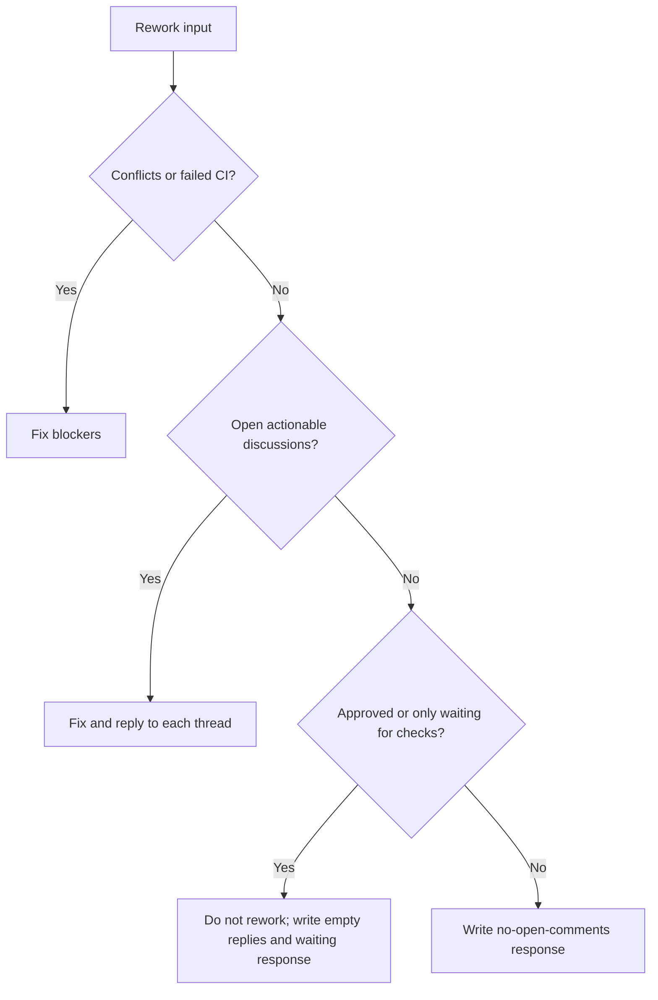

# PR rework

Use the configured instruction files and prompt packs.

Required flow:

1. Read the input context and open review threads.
2. Fix merge conflicts and CI failures first.
3. Address every actionable review comment.
4. Run relevant checks for changed files.
5. Write required files in `outputs/`.

Decision shortcut:

Do not commit, push, or create branches.

🛑 HARD RULES (enforced mechanically by a git guard in your session — violations fail loudly):
- NEVER push to the default/protected branch (`main`/`master`). Pushes — only ever to the PR head branch (the `ai/<ticket>` branch or the branch recorded in `input/<TICKET>/pr_info.md`) — are performed by the automated post-actions, not by you.
- NEVER use closing keywords (`closes #N`, `fixes #N`, `resolves #N`) in commit messages. Issue-closing keywords belong to the PR body; the squash-merge message owns closing the issue. A premature keyword auto-closes the issue before the fix is validated and merged.
