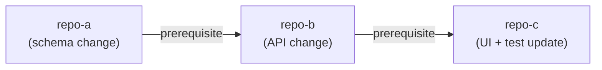

# Agent Snapshot: `story_solution_e2e`

- **Context ID**: `story_solution_e2e`

## Base cliPrompts

### [1] `./agents/instructions/story_solution/e2e_output_requirements.md`

# E2E Output Requirements

On top of all base `story_solution` instructions, this agent MUST produce three output files:

1. `outputs/response.md` — full solution design text **(REQUIRED — this is what gets written to Jira; without this file the ticket is not updated)**
2. `outputs/diagram.md` — Mermaid architecture diagram
3. `outputs/affected_repos.json` — affected repositories JSON array (format defined in the Affected Repositories Output section above)

**Do NOT print the solution to stdout.** Write it to `outputs/response.md`.

As your LAST step, verify all three files exist:
```bash
ls -la outputs/ && head -3 outputs/response.md && echo "OK: response.md exists"
```

If `outputs/response.md` is missing or empty — create it before finishing.


---

### [2] `./agents/instructions/story_solution/affected_repos_flow.md`

# Affected Repositories Output

## Purpose

After writing the solution design, produce `outputs/affected_repos.json` — a structured
list of every repository where code, configuration, migrations, or schema changes are needed.
This file is consumed by the post-action script to label the Jira ticket and generate a
visual dependency map.

---

## Output format

```json
[
  {
    "name": "repo-a",
    "reason": "Short explanation of what must change and why."
  },
  {
    "name": "repo-b",
    "reason": "Short explanation of what must change and why."
  },
  {
    "name": "repo-c",
    "reason": "Depends on schema from repo-a and API from repo-b.",
    "depends_on": ["repo-a", "repo-b"]
  }
]
```

| Field | Required | Description |
| --- | --- | --- |
| `name` | ✅ | Exact short repository name (no org prefix, no URL). |
| `reason` | ✅ | One sentence: what changes and why it is needed. |
| `depends_on` | ☐ | Names of other affected repos that must be completed first. Omit if no ordering constraint. |

---

## How to determine affected repositories

Include a repository when any of the following are true:

- Source code must be added or modified (new endpoint, new model field, new UI component, etc.)
- Database schema or migration script must be created
- Configuration or environment variable must be added
- API contract change requires the consumer to adapt
- Test suite must be updated to cover new behaviour

**Do NOT include** repositories that are only read at runtime (no code changes needed),
or that are affected only indirectly through a shared library version bump that requires
no code change.

---

## Dependency chain — Mermaid illustration

The `depends_on` field expresses a *must complete before* ordering constraint.
Use it whenever a change in one repo cannot be deployed or tested without a
prior change in another. The post-action renders the chain as:



Include this diagram in `outputs/diagram.md` whenever three or more repositories form a chain.
**Do NOT write an "Affected Repositories" section or table to `outputs/response.md`** — the post-action script appends that section automatically after saving the solution to Jira.

---

## Empty result

If the solution requires no repository changes (pure configuration, Jira-only update, etc.):

```json
[]
```


---

### [3] `./agents/instructions/story_solution/affected_repos_section_format.md`

# Affected Repositories Section Format

> **IMPORTANT: Do NOT write this section to `outputs/response.md`.**
> The post-action script appends it automatically after saving the solution to Jira.
> Your job is only to produce `outputs/affected_repos.json` with the correct data.

The post-action appends an *Affected Repositories* section to the ticket description
after the solution is written. Format the section according to the tracker-specific
markup rules already defined in `jira_markup_transform.md` (Jira) or
`ado_markup_transform.md` (ADO). This file only describes the **structure**.

---

## Structure

The section contains three parts in order:

1. **Table** — ordered list of affected repositories (topological order, prerequisites first)

   | Column | Content |
   |---|---|
   | `#` | Sequential number (1, 2, …) |
   | Repository | Short repo name, no org prefix |
   | Reason | One sentence: what changes and why |
   | Depends On | Comma-separated prerequisite repo names, or `—` if none |

2. **Dependency flow diagram** — Mermaid `graph LR` showing `depends_on` edges.
   Omit entirely when no repo has `depends_on`.

3. **JSON anchor** — the raw JSON array from `outputs/affected_repos.json`,
   wrapped in a labeled code block so the `createRepoTasks` script can locate and parse it.
   The label must be exactly `affected_repos`.

---

## Jira example

```
<hr>
<heading2>Affected Repositories</heading2>

||#||Repository||Reason||Depends On||
|1|repo-a|Short explanation.|—|
|2|repo-b|Short explanation.|repo-a|

<codeblock:mermaid>
graph LR
    repo-a --> repo-b
</codeblock:mermaid>

{code:json|title=affected_repos}
[{"name":"repo-a","reason":"..."},{"name":"repo-b","reason":"...","depends_on":["repo-a"]}]
{code}
<hr>
```

## ADO example

```
<hr>
<heading2>Affected Repositories</heading2>

|#|Repository|Reason|Depends On|
|---|---|---|---|
|1|repo-a|Short explanation.|—|
|2|repo-b|Short explanation.|repo-a|

<codeblock:mermaid>
graph LR
    repo-a --> repo-b
</codeblock:mermaid>

<codeblock:json>
[{"name":"repo-a","reason":"..."},{"name":"repo-b","reason":"...","depends_on":["repo-a"]}]
</codeblock:json>
<hr>
```

---

## Machine-parsing anchor

The `createRepoTasks` script locates the JSON by searching for
`{code:json|title=affected_repos}` (Jira) or the ` ```json ` block immediately
following `## Affected Repositories` (ADO), then:

1. Parses the JSON array
2. Topological-sorts by `depends_on`
3. Creates Sub-tasks in order and links them with *Blocks* Jira links


---
